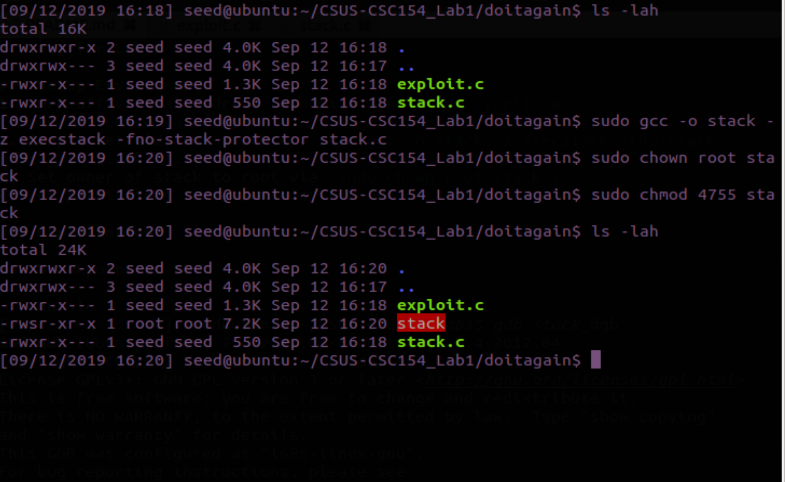
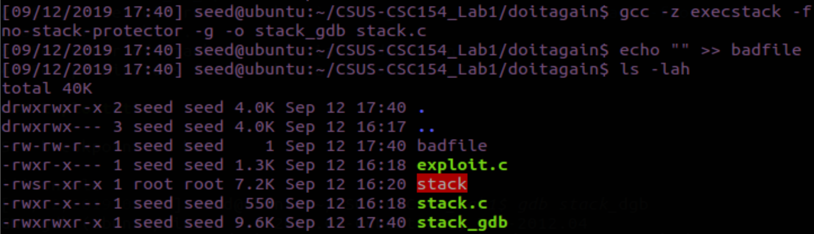
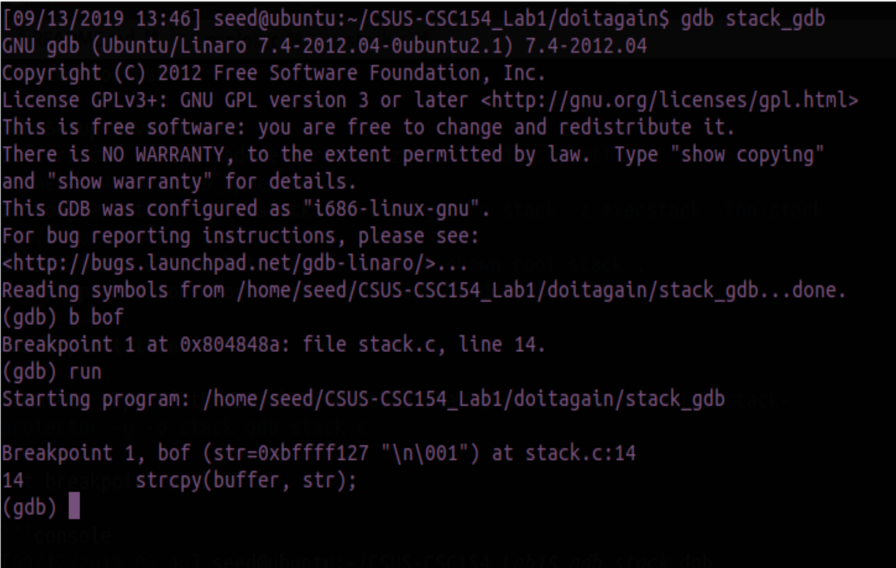
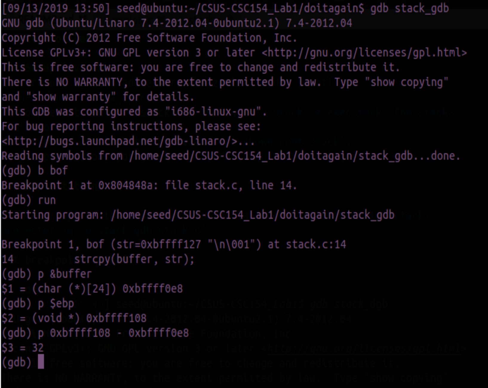
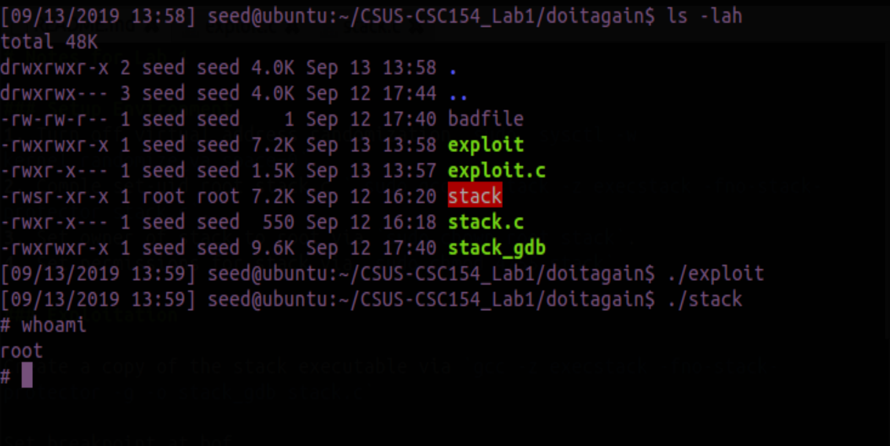
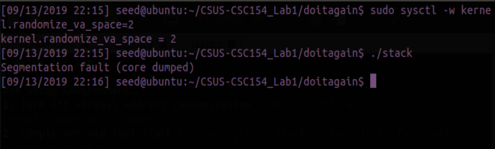
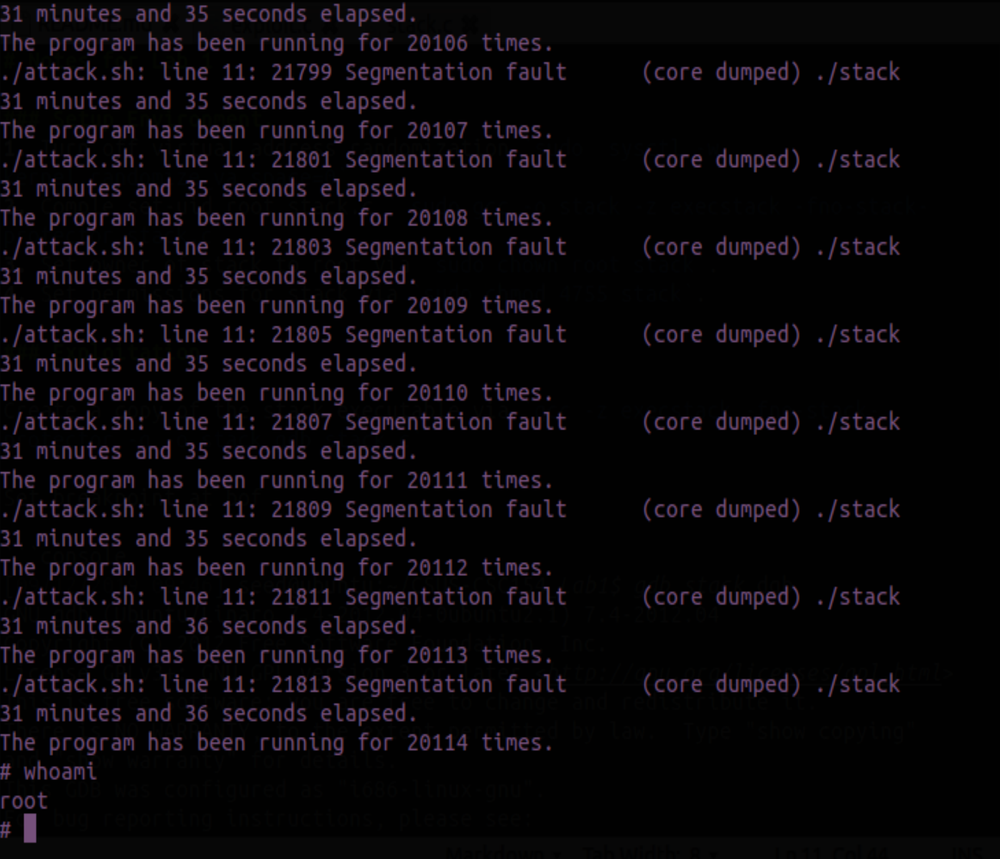

# CSUS CSC154: Lab 1
[Lab 1 PDF](./writeup/pdf/CSC154_Lab1_Ryan_Kozak.pdf)

## Introduction
Buffer overflow is defined as the condition in which a program attempts to write data beyond the boundaries of pre-allocated fixed length buffers. This vulnerability can be utilized by an attacker to alter the flow control of the program, even execute arbitrary pieces of code. This vulnerability arises due to the mixing of the storage for data (e.g. buffers) and the storage for controls (e.g. return addresses): an overflow in the data part can affect the control flow of the program, because an overflow can change the return address.

### Initial Setup
Most modern Linux-based operating systems implement address space randomization, by default, in order to to randomize the starting address of the heap and stack. In this lab we began by disabling this feature in order to simplify our buffer overflow attack by more easily calculating the return address. Address randomization is turned off via the following command `sudo  sysctl -w kernel.randomize_va_space=0`.

Next we download the vulnerable program **[stack.c](http://www.cis.syr.edu/~wedu/seed/Labs_12.04/Software/Buffer_Overflow/files/stack.c)**, and the exploit code **[exploit.c](http://www.cis.syr.edu/~wedu/seed/Labs_12.04/Software/Buffer_Overflow/files/exploit.c)**.

After this we compile the vulnerable program with an executable stack via `sudo gcc -o stack -z execstack -fno-stack-protector stack.c`. We then set ownership of the vulnerable program to the root user via `sudo chown root stack`. Finally we make the vulnerable program *set-root-uid* by issuing `sudo chmod 4755 stack`.


**Figure 1**: Intial setup of Task 1.

We're now ready to begin exploiting the buffer overflow vulnerability in **stack.c**.

## Task 1: Exploiting the Vulnerability (No Address Randomization)

### Calculating the return address
In order to achieve a buffer overflow, we must first calculate where the return address lies on the stack. Running the vulnerable executable in *GDB* allows us to print the address of *buffer* and the *ebp* register. These values can be used to calculate the address of where the function returns.

First recompile **stack.c** to create a copy we're able to work with via `gcc -z execstack -fno-stack-protector -g -o stack_gdb stack.c`. Now the executable we'll debug is called *stack_gdb*. Furthermore, we need a file named *badfile* in our directory in order to execute the program correctly. So we create an empty file with that name via `echo "" >> badfile`.


**Figure 2**: We are now ready to begin debugging.

We issue the command `gdb stack_gdb` to begin debugging the vulnerable executable. First we set a break point at the `bof()` function, where our buffer overflow vulnerability lies via `b bof`, and then issue `run` to hit said breakpoint.


**Figure 3**: GDB debugger at `bof()` breakpoint.

Now that we've reached our breakpoint at `bof()`, we print our address values for the *buffer* and *ebp* register. Subtracting the address of *buffer* from *ebp* will allow us to calculate the return address.


**Figure 4**: Offset is 32 bytes.

Since we see the value of the offset is 32 bytes, we can calculate the return address to be 36, as it's 4 bytes above this value in the stack. We can now complete our *exploit.c* file by adding the following code in `main()`.


```c
    /* You need to fill the buffer with appropriate contents here */
	  // From tasks A and B
	  *((long *)(buffer + 36)) = 0xbffff108 + 0x100;

	  // Place the shell code towards the end of the buffer
	  memcpy(buffer + sizeof(buffer) - sizeof(shellcode) , shellcode , sizeof(shellcode));
```


We then compile our exploit code via `gcc -o exploit exploit.c`, and run the exploit to generate the contents of our *badfile*. When we run the vulnerable program at this point we're able to cause a buffer overflow and achieve a root shell.


**Figure 5**: Root shell.


## Task 2: Exploiting the Vulnerability (Address Randomization)
For this exercise we turn address randomization back on via `sudo  sysctl -w kernel.randomize_va_space=2`. Now when we run the same attack which previously succeeded, we get a segmentation fault.


**Figure 6**: Segmentation fault caused by address randomization.


By running our attack in a loop, we're able to brute-force our return address. The following code runs our attack multiple times, measuring both the time elapsed and number of attempts before successfully guessing the return address and  gaining a root shell.   

Thanks to Professor Dai for providing this script to me for making these calculations.  

```bash
#!/bin/bash
SECONDS=0
value=0
while [ 1 ]
do
  value=$(( $value + 1 ))
  duration=$SECONDS
  echo "$(($duration / 60)) minutes and $(($duration %60)) seconds elapsed."
  echo "The program has been running for $value times."
  ./stack
done
```


**Figure 7**: Rooted with address randomization enabled.

The attack ran for 31 minutes & 36 seconds (20,114 times), before we finally gain our root shell.
