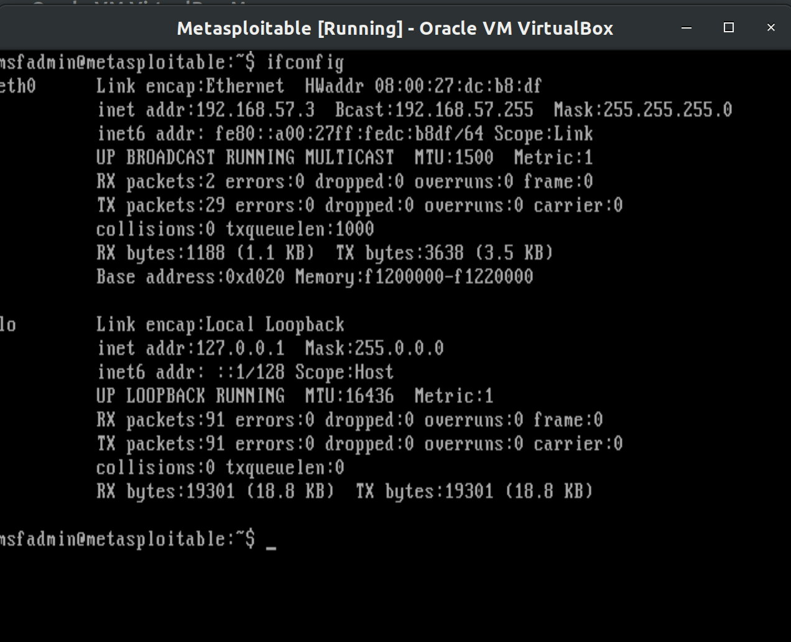

# CSUS CSC154: Lab 3
[Lab 3 PDF](./writeup/pdf/CSC154_Lab3_Ryan_Kozak.pdf)

## Goal  
To use Kali Linux to perform penetration testing towards Metasploitable.  

## Setup  
We start this lab based on the lab environments set up during Lab 2, in which we configured VirtualBox for both our Kali VM and Metasploitable VM(s) to be on a host-only virtual network.  

Now we open both Kali and Metasploitable, and use `ifconfig` to determine the IP address of each VM.  
**Note:** We will scan the whole IP range with Nmap, this is just to confirm our settings.    

  
**Figure 1:** Kali Linux IP at `192.168.57.4`.  

  
**Figure 2:** Metasploitable IP at `192.168.57.3`.  

On our Kali machine, we need to start the PostgreSQL service in order to run Metasploit and Armitage. To start PostgreSQL we run `service postgresql start`.  
  
**Figure 3:** Starting PostgreSQL service.  

Now that we've launched PostgreSQL, we can launch Armitage via the command `armitage`.  
  
**Figure 4:** Launching Armitage  

## Information Gathering  
In a real attack scenario, we would not already know the IP address of our Metasploitable machine. We know what it is because we checked during the setup phase, but to be realistic we're going to run an Nmap scan through Armitage to find Metaspliotable add it as a target (rather than adding the IP address directly).  
  
**Figure 5:** Armitage run an Nmap scan for `192.168.57.0/24`.  

  
**Figure 6:** Nmap scan complete, targets found.

In Figure 6 above we've discovered the Metasploitable target at `192.168.57.3`.  

## Attack  
Now that we've added our target to Armitage, we select it by clicking on it, and run a *Hail Mary* attack. This is done by navigating to `Attacks -> Hail Mary`. In case the reader isn't familiar with American football terminology, a Hail Mary is a pass defined as the following.
> Hail Mary pass : a long forward pass in football thrown into or near the end zone in a last-ditch attempt to score as time runs out.

The Hail Mary Attack is a last-ditch effort to break into a system, it is reckless, unstealthy, and desperate. It throws every known exploit possible at the machine hoping that something works. Realistically, you shouldn't ever do this, but for the lab it's fun.  So, here we go.  
  
**Figure 7:** Are you sure you really want to do something this crazy? Yes we are!    

The Hail Mary attack has given us 4 sessions on the machine. As seen in Figure 9 below.  
  
**Figure 8:** 4 sessions opened after Hail Mary.  

Some of these sessions are as the user `www-data`. Instead of using one of these sessions and having to escalate privileges, we'll check to see if any of our sessions have gotten us `root` access. As we can see, session 2 is `root`.  So for the following steps, we'll be using this session.  
  
**Figure 9:** Session 2 is `root` user, as seen in the shell output for `whoami`.  

Now, we select from the left-hand column `post->multi->manage-shell_to_meterpreter`, and run it. We must make sure to run it on session 2, because as we stated previously, this session is root. This will give us a meterpreter session as the root user.  
  
**Figure 10:** Launching `shell_to_meterpreter`.  

  
**Figure 11:** Completion of `shell_to_meterpreter`.

Once the `shell_to_meterpreter` command is completed, we can right-click the victim host icon and select `Meterpreter 5 -> Interact -> Meterpreter Shell`. This will open a Meterpreter session.  
  
**Figure 12:** Opening a Meterpreter Shell to interact with.  

Through the Meterpreter shell we can run a hashdump via `run post/linux/gather/hashdump`.  
  
**Figure 13:** Running hasdump through Meterpreter.

In the Meterpreter session, we'll play with some more commands. The Meterpreter Cheat Sheet found [**here**](https://www.blueliv.com/downloads/Meterpreter_cheat_sheet_v0.1.pdf) provides a good reference of available commands.  

We can execute some system commands such as `route`, to view and modify the networking table and `sysinfo` to get more information about our target host.  
  
**Figure 14:** Running `route` and `sysinfo` through Meterpreter.  

There are a lot of useful scripts in Meterpreter than can be run. Once we're the root user on the machine many of them aren't necessary though. This is because we don't need to gather information we already know, or escalate privileges to the account we've already got access to. Some of the useful ones in our case can be found in the `post/multi/gather` folder. These scripts will search the system for various things such as stored passwords, keys, etc.  In the figure below use use `run post/multi/gather/ssh_creds` to try and gather some ssh key credentials. It fails to find any, but it's a neat script none the less.  
  
**Figure 15:** Running `post/multi/gather/ssh_creds`.  

To steal all the systems configuration files for analysis we can use the command `run post/linux/gather/enum_configs`.  
  
**Figure 16:** Finding and gathering all system configuration files via `post/linux/gather/enum_configs`.  

## Pivoting  

It is time to pivot from the victim machine we've compromised at address `192.168.57.3` to another target host on the network. The victim we've compromised is now our firebase.  

To get another victim running, we'll simply clone our Metasploitable VM, and launch the clone.  
  
**Figure 17:** 2 copies of Metasploitable VM running.

 Now we run an Nmap scan once more to find this new target.  
  
**Figure 18:** New Nmap scan reveals cloned Metasploitable VM is at `192.168.57.5`.

Now we can right click on our firebase (original victim at `192.168.57.3`) and select `Meterpreter -> Pivoting -> Setup`. In the setup window we choose `Add Pivot`.  
  
**Figure 19:**  Adding pivot point from `192.168.57.3`.  

We now click our next target and use `exploit/multi/samba/usermap_script`, setting the `LHOST` to the address of our firebase at `192.168.57.3`. We see the arrow becomes solid green, establishing our pivot point through the network to `192.168.57.5`.  
  
**Figure 20:** Exploited `192.168.57.5` via pivot.  

