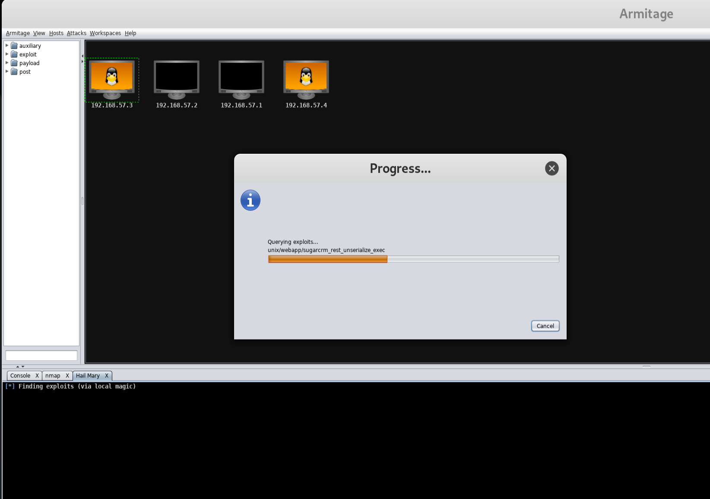

# CSUS CSC154: Lab 3
[Lab 3 PDF](./writeup/pdf/CSC154_Lab3_Ryan_Kozak.pdf)

## Goal  
To use Kali Linux to perform a penetration testing towards Metasploitable.  

## Setup  
We start this lab based on the lab environments set up during Lab 2, in which we configured VirtualBox for both our Kali VM and Metasploitable VM(s) to be on a host-only virtual network.  

Now we open both Kali and Metasploitable, and use ifconfig to know both IPs. **Note:** we will scan the whole IP range with Nmap, this is just to confirm our settings.    

  
**Figure 1:** Kali Linux IP at `192.168.57.4`.  

  
**Figure 2:** Metasploitable IP at `192.168.57.3`.  

On our Kali machine, we need to start PostgreSQL service in order to run Metasploit and Armitage. To start PostgreSQL we run `service postgresql start`.  
  
**Figure 3:** Starting PostgreSQL service.  

Now that we've launched PostgreSQL, we can launch Armitage via the command `armitage`.  
  
**Figure 4:** Launching Armitage  

## Information Gathering  
In a real attack scenario, we would not already know the IP address of our Metasploitable machine. We know what it is because we checked during the setup phase, but to be realistic we're going to run an Nmap scan through Armitage to add it as a target  (rather than adding the IP address directly).  
  
**Figure 5:** Armitage run an Nmap scan for `192.168.57.0/24`.  

  
**Figure 6:** Nmap scan complete, targets found.

In Figure 6 above we've discovered the Metasploitable target at `192.168.57.3`.  

## Attack  
Now that we've added our target to Armitage, we select it by clicking on it, and run a *Hail Mary* attack. This is done by navigating to `Attacks -> Hail Mary`. In case the reader isn't familiar with American football terminology, a Hail Mary is a pass defined as the following.
> Hail Mary pass : a long forward pass in football thrown into or near the end zone in a last-ditch attempt to score as time runs out.

The Hail Mary Attack is a last-ditch effort to break into a system, it is reckless, unstealthy, and desperate. It throws every known exploit possible at the machine hoping that something works. Realistically, you shouldn't ever do this, but for the lab it's fun.  So, here we go.  
  
**Figure 7:** Are you sure you really want to do something this crazy? Yes we are!  

  
**Figure 8:** Hail Mary attack looking for all possible exploits, then running them ALL.  

The Hail Mary attack has given us 4 sessions on the machine. As seen in Figure 9 below.  
  
**Figure 9:** 4 sessions opened after Hail Mary.  

Some of our sessions are as the user `www-data`. Instead of using these and having to escalate privileges, we'll check to see if any of our sessions have gotten us `root` access. As we can see, session 2 is `root`.  So for the following steps, we'll be using this session.  
  
**Figure 10:** Session 2 is `root` user, as seen in the shell output for `whoami`.  

Now, we select from the left-hand column `post->multi->manage-shell_to_meterpreter`, and run it. We must make sure to run it on session 2, because as we stated previously, this session is root. This will give us a meterpreter session as the root user.  
  
**Figure 11:** Launching `shell_to_meterpreter`.  

  
**Figure 12:** Completion of `shell_to_meterpreter`.

Once the `shell_to_meterpreter` command is completed, we can the victim host icon, to go `Meterpreter 5 -> Interact -> Meterpreter Shell`, and a session will be open to to us.  
  
**Figure 13:** Opening a Meterpreter Shell to interact with.  

