# CSUS CSC154: Lab 4
[Lab 4 PDF](./writeup/)

## Goal  
To fully understand the weakness of the implementation of the Heartbeat protocol.

## Overview  
The Heartbleed bug ([CVE-2014-0160](https://nvd.nist.gov/vuln/detail/CVE-2014-0160)) is a severe implementation flaw in the OpenSSL library, which enables attackers to steal data from the memory of the victim server. The contents of the stolen data depend on what is there in the memory of the server. It could potentially contain private keys, TLS session keys, user names, passwords, credit cards, etc. The vulnerability is in the implementation of the Heartbeat protocol, which is used by SSL/TLS to keep the connection alive.  

The objective of this lab is for students to understand how serious this vulnerability is, how the attack works, and how to fix the problem. The affected OpenSSL version range is from `1.0.1` to `1.0.1f`. The version in our Ubuntu VM is `1.0.1`.  
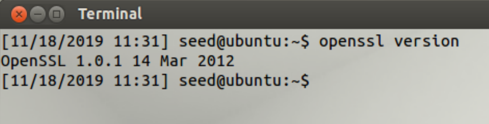  
**Figure 1:** OpenSSL Version on our VM.  

## Setup  
We will use two virtual machines for this lab, both of them being `SEEDUbuntu12.04`.  
  
**Figure 2:** Two VMs of `SEEDUbuntu12.04`.  

Each machine will be connected to our host-only virtual network. We will use one machine as the host, and another as the attacker.  The hosts IP address is determined via `ifconfig` and that address is set in the `/etc/hosts` file for our attacker machine for `www.heartbleedlabelgg.com`.  
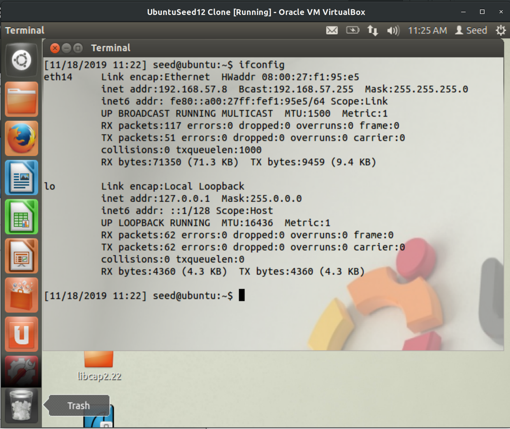  
**Figure 3:** The IP address of our host machine.  

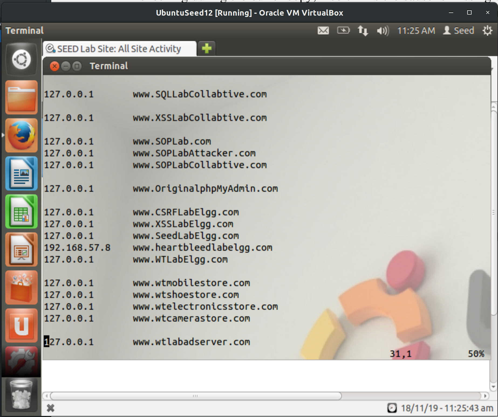  
**Figure 4:** Modify attacker VM's host file for `www.heartbleedlabelgg.com` to match IP of our second VM.  

## Task 1: Launch the Heartbleed Attack  

We will launch the Heartbleed attack on a social network site preconfigured on our virtual machine. Because the actual damage of the Heartbleed attack depends on what kind of information is stored in the server memory, we need to interact with the web server as legitimate users first.  

To generate data we'll visit `https://www.heartbleedlabelgg.com` and login as the site administrator `User Name:admin; Password:seedelgg`.  
  
**Figure 5:** Logging in as admin user.  

After logging in we'll add `Boby` as friend, by going to `More -> Members`, selecting Boby, and then cliding`Add Friend`.  
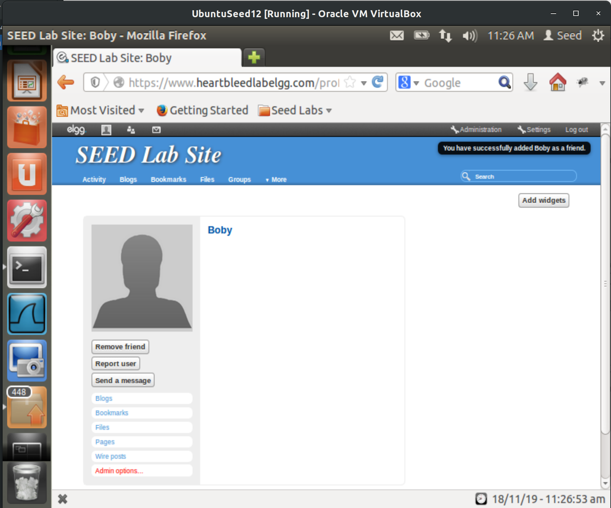  
**Figure 6:** Boby added as a friend.  

Lastly we will send Boby a private message.  
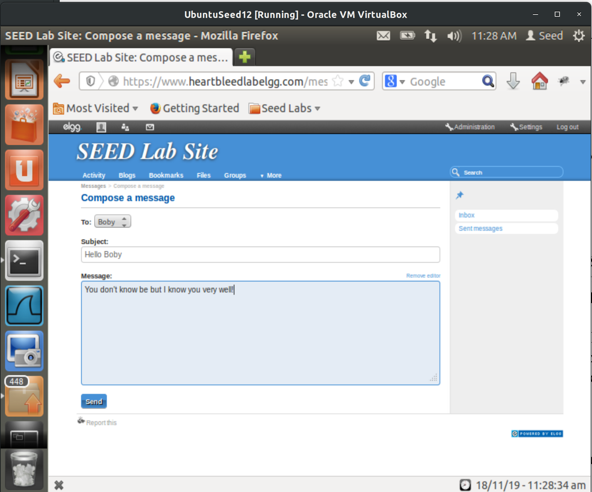  
**Figure 7:** Sending Boby a private message.

After we have done enough interactions as legitimate users, you can launch the attack and see what information we can get out of the victim server. Writing the program to launch the Heartbleed attack from scratch is not easy, because it requires the low-level knowledge of the Heartbeat protocol. Fortunately, other people have already written the attack code. Therefore, we will use the existing code to gain first-hand experience in the Heartbleed attack. The code that we use is called **[attack.py](http://www.cis.syr.edu/~wedu/seed/Labs_12.04/Networking/Heartbleed/attack.py)**, which was originally written by Jared Stafford. 

We run the attack code via `python ./attack.py www.heartbleedlabelgg.com`. The attack must be run multiple times to get useful data. After running it several times we've retrieved the following valuable pieces of information.  

User name and password for `admin`, which was the account we logged in as.    
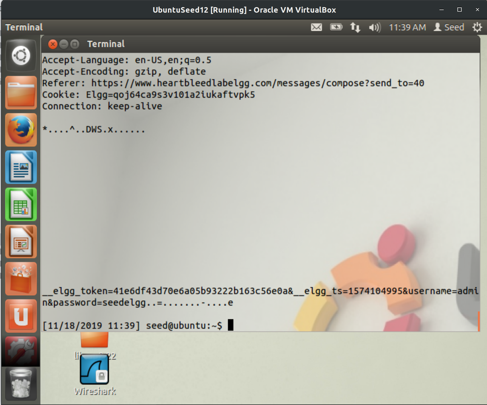  
**Figure 8:** Username and password data for `admin`.

For the user's activity, we can see that he navigated to the profile for Boby, and composed a private message.  
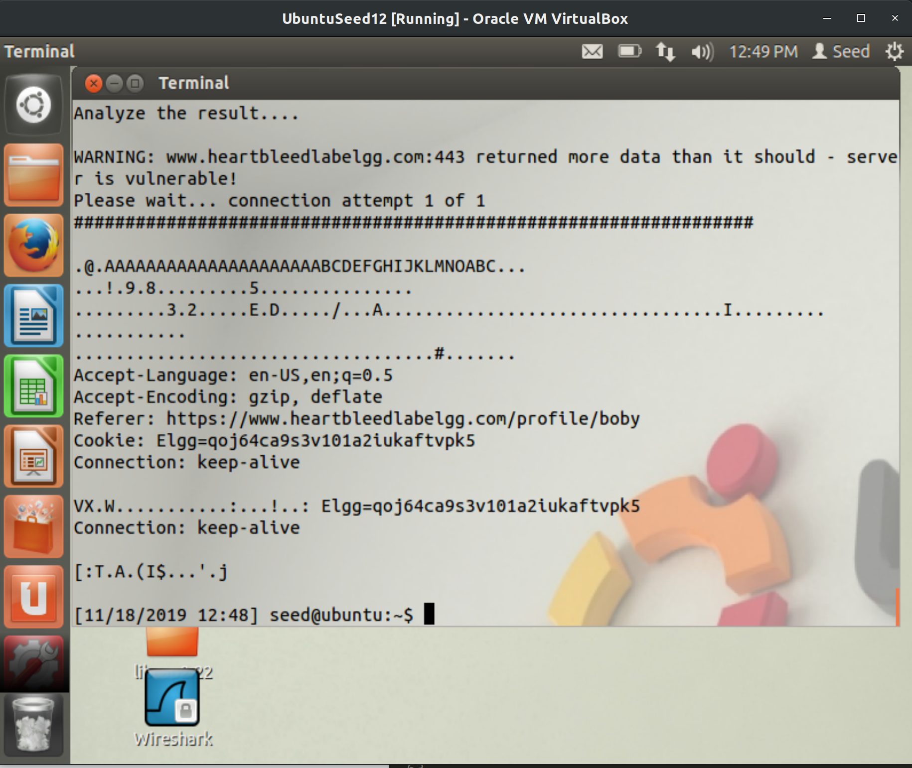  
**Figure 9:** User visits profile for Boby.  

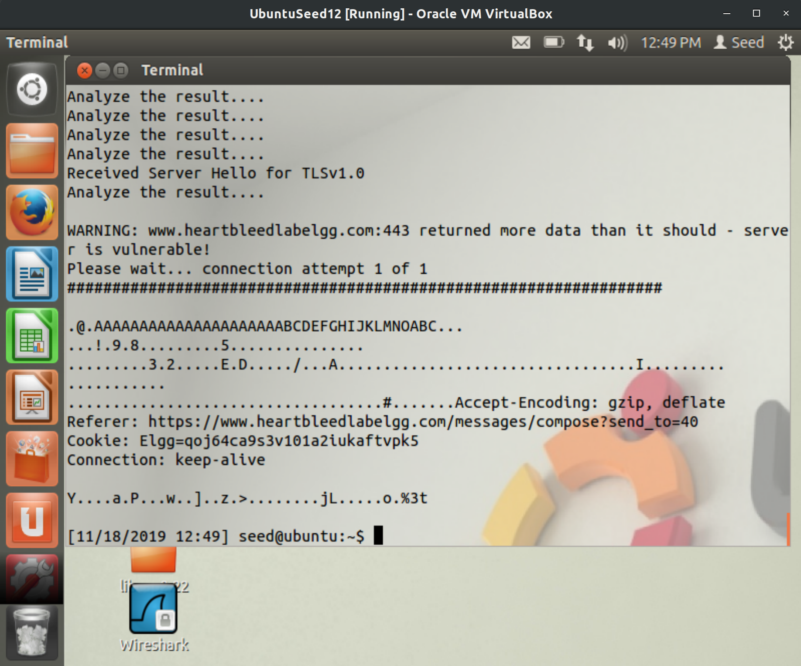  
**Figure 10:** Composing a private message to Boby.  

The exact content of the private message are present in the `subject` and `body` parameters of the private message request, as well as the recipient's `guid`.      
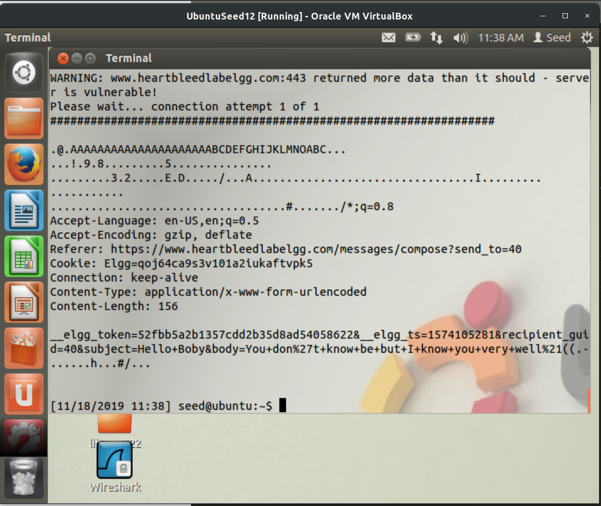  
**Figure 11:** Contents of private message.  

## Task 2: Find the Cause of the Heartbleed Vulnerability  

**Question 2.1:** As the length variable decreases, what kind of difference can you observe?  
* The length of the response will decrease accordingly. Below are examples of lengths for `0x3E8` bytes, and `0x64` bytes (1000, and 100 in decimal), and their responses. When we set the length below the boundary we receive only `.F` as observable in Figure 13 in answer 2.2.  
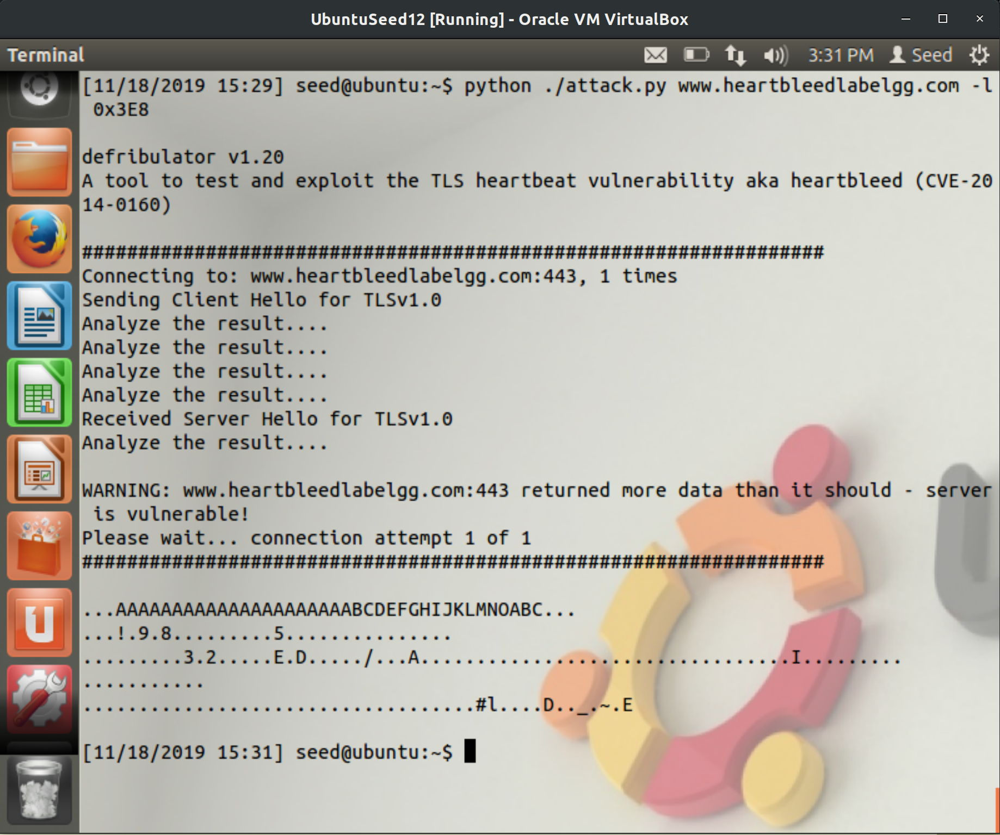  
**Figure 12:** Length of `0x3E8` bytes and the response.  

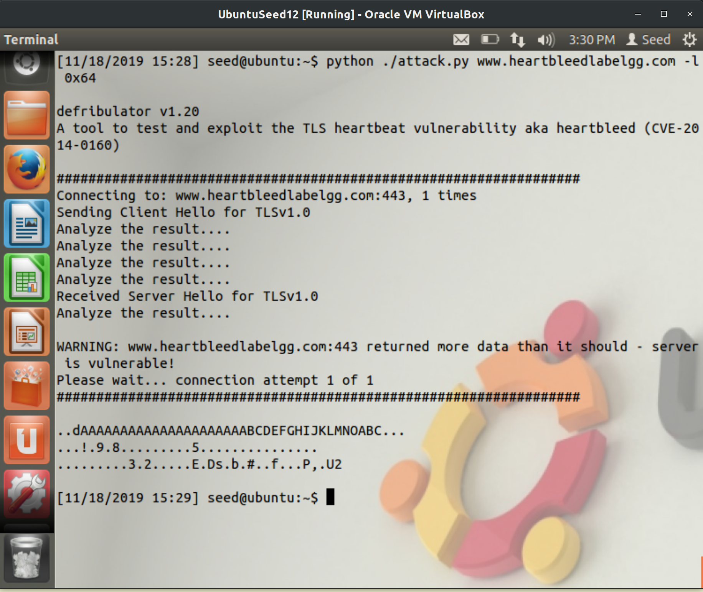  
**Figure 13:** Length of `0x64` bytes and the response.  

**Question 2.2:** As the length variable decreases, there is a boundary value for the input length variable. At or below that boundary, the Heartbeat query will receive a response packet without attaching any extra data (which means the request is benign). Please find that boundary length. You may need to try many different length values until the web server sends back the reply without extra data. To help you with this, when the number of returned bytes is smaller than the expected length, the program will print `Server processed malformed Heartbeat, but did not return any extra data`.   

*  The boundary value for input length is `0x16` bytes or `22` in decimal. We can observe this by inputting `0x16` as the length and getting the message `Server processed malformed Heartbeat, but did not return any extra data`.  
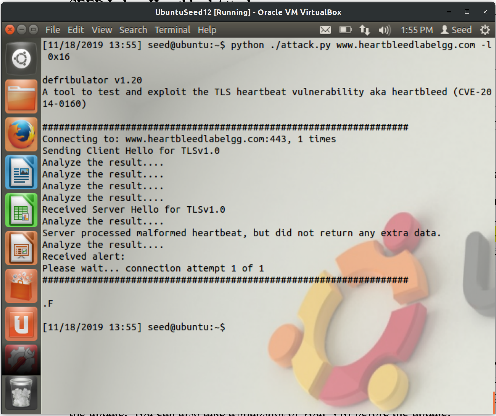  
**Figure 14:** Boundary value for input length `0x16`.  
* Increasing the value to `0x17` or `23` in decimal will give us the message `returned more data than it should`. This confirms `0x16` is the bound.  
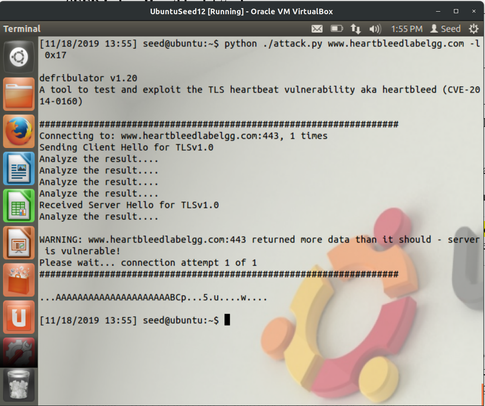  
**Figure 15:** `0x17` is one above the bound, confirming the bound to be `0x16`.  

## Task 3: Countermeasure and Bug Fix  
To fix the Heartbleed vulnerability, the best way is to update the `OpenSSL` library to the newest version. This can be achieved using the following command, which updates the repository and then upgrades all packages `sudo apt-get update && sudo apt-get upgrade`.  
**Note:** We'll need to run this on the host machine, not the attacker. We'll also need to temporarily set the Virtual Box Network Adapter to `NAT` to have Internet access.