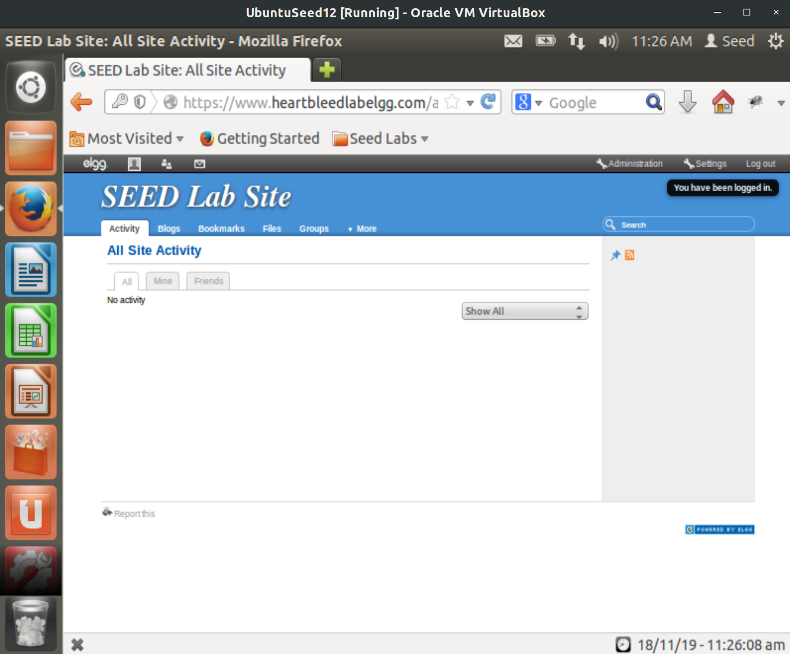

# CSUS CSC154: Lab 4
[Lab 4 PDF](./writeup/)

## Goal  
To fully understand the weakness of the implementation of the Heartbeat protocol.

## Overview  
The Heartbleed bug ([CVE-2014-0160](https://nvd.nist.gov/vuln/detail/CVE-2014-0160)) is a severe implementation flaw in the OpenSSL library, which enables attackers to steal data from the memory of the victim server. The contents of the stolen data depend on what is there in the memory of the server. It could potentially contain private keys, TLS session keys, user names, passwords, credit cards, etc. The vulnerability is in the implementation of the Heartbeat protocol, which is used by SSL/TLS to keep the connection alive.  

The objective of this lab is for students to understand how serious this vulnerability is, how the attack works, and how to fix the problem. The affected OpenSSL version range is from `1.0.1` to `1.0.1f`. The version in our Ubuntu VM is `1.0.1`.  
  
**Figure 1:** OpenSSL Version on our VM.  

## Setup  
We will use two virtual machines for this lab, both of them being `SEEDUbuntu12.04`.  
  
**Figure 2:** Two VMs of `SEEDUbuntu12.04`.  

Each machine will be connected to our host-only virtual network. We will use one machine as the host, and another as the attacker.  The hosts IP address is determined via `ifconfig` and that address is set in the `/etc/hosts` file for our attacker machine for `www.heartbleedlabelgg.com`.  
  
**Figure 3:** The IP address of our host machine.  

  
**Figure 4:** Modify attacker VM's host file for `www.heartbleedlabelgg.com` to match IP of our second VM.  


## Task 1: Launch the Heartbleed Attack  

We will launch the Heartbleed attack on a social network site preconfigured on our virtual machine. Because the actual damage of the Heartbleed attack depends on what kind of information is stored in the server memory, we need to interact with the web server as legitimate users first.  

To generate data we'll visit `https://www.heartbleedlabelgg.com` and login as the site administrator `User Name:admin; Password:seedelgg`.  
  
**Figure 5:** Logging in as admin user.  


After logging in we'll add `Boby` as friend, by going to `More -> Members`, selecting Boby, and then clicking`Add Friend`.  
  
**Figure 6:** Boby added as a friend.  


Lastly we will send Boby a private message.  
  
**Figure 7:** Sending Boby a private message.


After we have done enough interactions as legitimate users, we can launch the attack and see what information we can get out of the victim server. Writing the program to launch the Heartbleed attack from scratch is not easy, because it requires the low-level knowledge of the Heartbeat protocol. Fortunately, other people have already written the attack code. Therefore, we will use the existing code to gain first-hand experience in the Heartbleed attack. The code that we use is called **[attack.py](http://www.cis.syr.edu/~wedu/seed/Labs_12.04/Networking/Heartbleed/attack.py)**, which was originally written by Jared Stafford. 

We run the attack code via `python ./attack.py www.heartbleedlabelgg.com`. The attack must be run multiple times to get useful data. After running it several times we've retrieved the following valuable pieces of information.  

User name and password for `admin`, which was the account we logged in as.    
  
**Figure 8:** Username and password data for `admin`.


For the user's activity, we can see that he (we) navigated to the profile for Boby, and composed a private message.  
  
**Figure 9:** User visits profile for Boby.  

  
**Figure 10:** Composing a private message to Boby.  

The exact contents of the private message are present in the `subject` and `body` parameters of the private message request, as well as the recipient's `guid` showing us to shall receive the message.      
  
**Figure 11:** Contents of private message.  


## Task 2: Find the Cause of the Heartbleed Vulnerability  

**Question 2.1:** As the length variable decreases, what kind of difference can you observe?  
* The length of the response will decrease accordingly. Below are examples of lengths for `0x3E8` bytes, and `0x64` bytes (1000, and 100 in decimal), and their responses. When we set the length below the boundary we receive only `.F` as observable in Figure 13 in answer 2.2.  
  
**Figure 12:** Length of `0x3E8` bytes and the response.  

  
**Figure 13:** Length of `0x64` bytes and the response.  

**Question 2.2:** As the length variable decreases, there is a boundary value for the input length variable. At or below that boundary, the Heartbeat query will receive a response packet without attaching any extra data (which means the request is benign). Please find that boundary length. You may need to try many different length values until the web server sends back the reply without extra data. To help you with this, when the number of returned bytes is smaller than the expected length, the program will print `Server processed malformed Heartbeat, but did not return any extra data`.   

*  The boundary value for input length is `0x16` bytes or `22` in decimal. We can observe this by inputting `0x16` as the length and getting the message `Server processed malformed Heartbeat, but did not return any extra data`.  
  
**Figure 14:** Boundary value for input length `0x16`.  
* Increasing the value to `0x17` or `23` in decimal will give us the message `returned more data than it should`. This confirms `0x16` is the bound.  
  
**Figure 15:** `0x17` is one above the bound, confirming the bound to be `0x16`.  


## Task 3: Countermeasure and Bug Fix  
To fix the Heartbleed vulnerability, the best way is to update the `OpenSSL` library to the newest version. Attempting to update via `sudo apt-get update && sudo apt-get upgrade` did not succeed. After updating all packages the version of `OpenSSL` remained the same. I chose to upgrade it to version `1.0.2l` via *[this method](https://www.miguelvallejo.com/updating-to-openssl-1-0-2g-on-ubuntu-server-12-04-14-04-lts-to-stop-cve-2016-0800-drown-attack/)*, which involves using `wget` to retrieve the Tarball from OpenSSL's site, and building it locally. **Note:** We'll need to run this on the host machine, not the attacker. We'll also need to temporarily set the Virtual Box Network Adapter to `NAT` to have Internet access.  
  
**Figure 16:** `OpenSSL` updated to `1.0.2l`, which is no longer vulnerable to Heartbleed.  

### Task 3.1  
We repeat the attack after updating to `OpenSSL version 1.0.2l` and see that we can no longer get a response besides `.F`. Heartbleed has been patched and so we can no longer steal data from memory.  
  
**Figure 17:** Server response after patching Heartbleed.  

### Task 3.2  
The objective of this task is to figure out how to fix the Heartbleed bug in the source code. The following C-style structure (not exactly the same as the source code) is the format of the Heartbeat request/response packet.  

```c
struct {
	HeartbeatMessageType type; // 1 byte: request or the response
	uint16 payload_length;    // 2 byte: the length of the payload
	opaque payload[HeartbeatMessage.payload_length];
	opaque padding[padding_length];
} HeartbeatMessage;
```  

The first field (1 byte) of the packet is the type information, and the second field (2 bytes) is the payload length, followed by the actual payload and paddings. The size of the payload should be the same as the value in the payload length field, but in the attack scenario, payload length can be set to a different value. The following code snippet shows how the server copies the data from the request packet to the response packet.

```c
/* Allocate memory for the response, size is 1 byte
* message type, plus 2 bytes payload length, plus
* payload, plus padding
*/

unsigned int payload;
unsigned int padding = 16; /* Use minimum padding */

// Read from type field first

hbtype = *p++; //After this instruction, the pointer p will point to the payload_length field.

// Read from the payload_length field
// from the request packet
n2s(p, payload); 
/* Function n2s(p, payload) reads 16 bits from pointer p and store the
   value in the INT variable "payload". */

pl=p; // pl points to the beginning of the payload content

if (hbtype == TLS1_HB_REQUEST)
{
	unsigned char *buffer, *bp;
	int r;

	/* Allocate memory for the response, size is 1 byte
	* message type, plus 2 bytes payload length, plus
	* payload, plus padding
	*/

	buffer = OPENSSL_malloc(1 + 2 + payload + padding);
	bp = buffer;

	// Enter response type, length and copy payload
	*bp++ = TLS1_HB_RESPONSE;
	s2n(payload, bp);

	// copy payload
	memcpy(bp, pl, payload); /* pl is the pointer which
	* points to the beginning
	of the payload content */


	bp += payload;

	// Random padding
	RAND_pseudo_bytes(bp, padding);

	// this function will copy the 3+payload+padding bytes
	// from the buffer and put them into the heartbeat response
	// packet to send back to the request client side.
	OPENSSL_free(buffer);
	r = ssl3_write_bytes(s, TLS1_RT_r = ssl3_write_bytes(s, TLS1_RT_HEARTBEAT, buffer,
	3 + payload + padding);

}
```

The problem from the code above is that is that it reads directly from the `payload_length` field of the request packet, which is what we've been playing with in our attacks.  
```c
// Read from the payload_length field
// from the request packet
n2s(p, payload);
```

A solution to the code above can be found by looking at the patch directly provided by `OpenSSL`, as their code is open source.

```c

/* Read type and payload length first */

if (1 + 2 + 16 > s->s3->relent)

return 0;

/* silently discard */

hbtype = *p++;

n2s(p, payload);

if (1 + 2 + payload + 16 > s->s3->rrec.length)

return 0;

/* silently discard per RFC 6520 sec. 4 */

pl = p;
```

The code above will check that the heartbeat request is not `0` (first `if` statement), and then confirm that request length is valid (second `if` statement).  


We will comment on the discussion below.  
 * **Alice** thinks the fundamental cause is missing the boundary checking during the buffer copy.
 	* This is true, the vulnerability is caused by a lack of confirming the length of the packet.
 * **Bob** thinks the cause is missing the user input validation
 	* This is also true, the code used the user specified length, and did not validate it against the actual length of the packet.
 * **Eva** thinks that we can just delete the length value from the packet to solve everything.  
 	* This doesn't make sense, we need the length for functionality purposes.  


