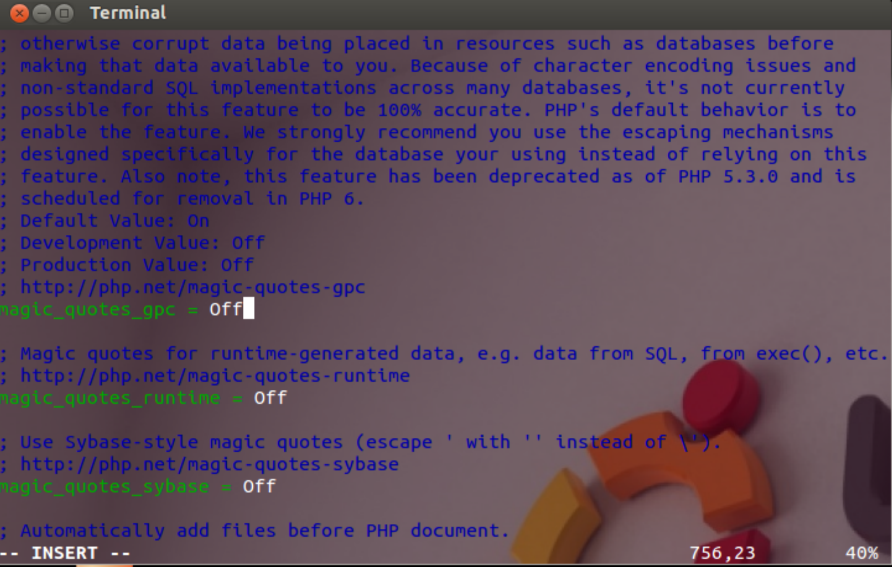

# CSUS CSC154: Lab 5 - SQL Injection  
[Lab 5 PDF](./writeup/pdf/)  

## Goal  
To fully understand the weakness in SQL semantics and know how to exploit the vulnerabilities in the interface between web applications and database servers, for retrieval of unallowed data.  

## Overview  
SQL injection is a code injection technique that exploits the vulnerabilities in the interface between web applications and database servers. The vulnerability is present when user's inputs are not correctly checked within the web applications before being sent to the back-end database servers. Many web applications take inputs from users, and then use these inputs to construct SQL queries, so the web applications can get information from the database. Web applications also use SQL queries to store information in the database. These are common practices in the development of web applications. When SQL queries are not carefully constructed, SQL injection vulnerabilities can occur. The SQL injection attack is one of the most common attacks on web applications. 

In this lab, we have created a web application that is vulnerable to the SQL injection attack. Our web application includes the common mistakes made by many web developers. Students' goal is to find ways to exploit the SQL injection vulnerabilities, demonstrate the damage that can be achieved by the attack, and master the techniques that can help defend against such type of attacks.  

## Setup  
The `SEEDUbuntu12.04` has come pre-configured with most of what we need to complete this lab.  

First, we must turn off the PHP mechanism to automatically defend against SQL injection attacks. The method called `magic quote`. This is done by editing the configuration file found in `/etc/php5/apache2/php.ini`, setting `magic_quotes_gpc = Off`, and then restarting apache.  
  
**Figure 1:** Editing PHP configuration to turn off SQL Injection defense mechanism.  

Next we must patch the VM for this lab. We download the patch file called `patch.tar.gz` from **[here](http://www.cis.syr.edu/~wedu/seed/Labs_12.04/Web/Web_SQL_Injection/files/patch.tar.gz)**. The file includes the web application and a script that will install all of the required files needed for this lab. We place `patch.tar.gz` in our home folder, unzip it, and run a script called `bootstrap.sh`.   

