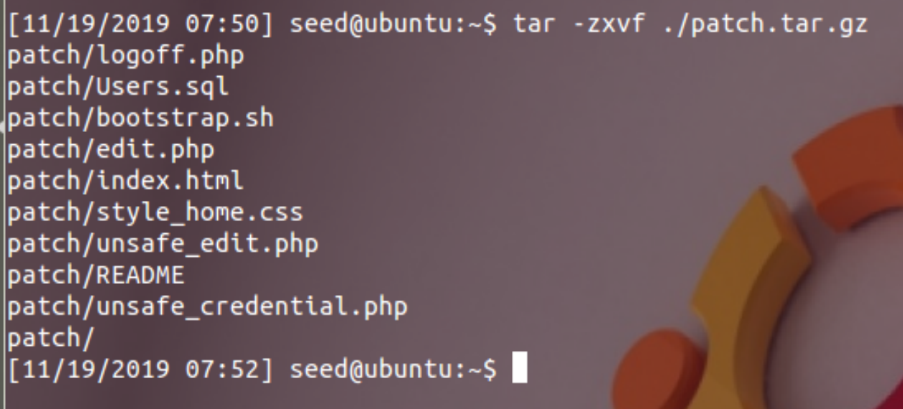
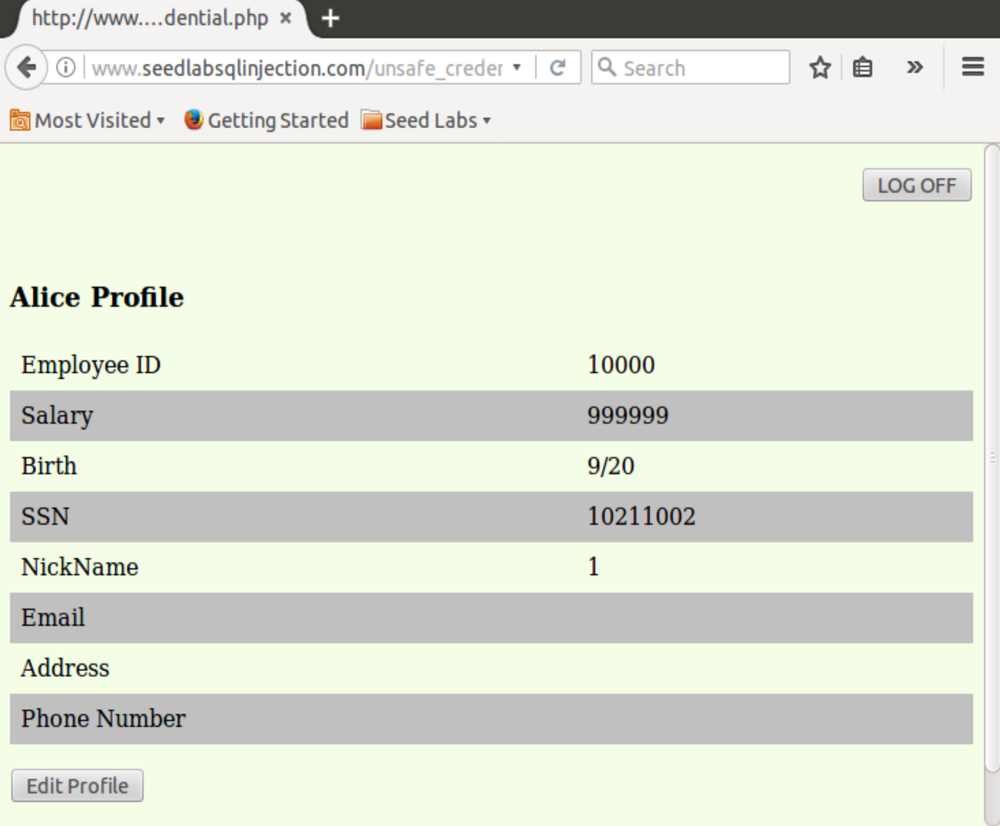

# CSUS CSC154: Lab 5 - SQL Injection  
[Lab 5 PDF](./writeup/pdf/)  

## Goal  
To fully understand the weakness in SQL semantics and know how to exploit the vulnerabilities in the interface between web applications and database servers, for retrieval of unallowed data.  

## Overview  
SQL injection is a code injection technique that exploits the vulnerabilities in the interface between web applications and database servers. The vulnerability is present when user's inputs are not correctly checked within the web applications before being sent to the back-end database servers. Many web applications take inputs from users, and then use these inputs to construct SQL queries, so the web applications can get information from the database. Web applications also use SQL queries to store information in the database. These are common practices in the development of web applications. When SQL queries are not carefully constructed, SQL injection vulnerabilities can occur. The SQL injection attack is one of the most common attacks on web applications. 

In this lab, we have created a web application that is vulnerable to the SQL injection attack. Our web application includes the common mistakes made by many web developers. Students' goal is to find ways to exploit the SQL injection vulnerabilities, demonstrate the damage that can be achieved by the attack, and master the techniques that can help defend against such type of attacks.  

## Setup  
The `SEEDUbuntu12.04` has come pre-configured with most of what we need to complete this lab.  

First, we must turn off the PHP mechanism to automatically defend against SQL injection attacks. The method called `magic quote`. This is done by editing the configuration file found in `/etc/php5/apache2/php.ini`, setting `magic_quotes_gpc = Off`, and then restarting apache.  
  
**Figure 1:** Editing PHP configuration to turn off SQL Injection defense mechanism.  

Next we must patch the VM for this lab. We download the patch file called `patch.tar.gz` from **[here](http://www.cis.syr.edu/~wedu/seed/Labs_12.04/Web/Web_SQL_Injection/files/patch.tar.gz)**. The file includes the web application and a script that will install all of the required files needed for this lab. First we download `patch.tar.gz` to our home folder and extract it.   
  
**Figure 2:** Downloading `patch.tar.gz`.  

  
**Figure 3:** Extracting patch.

The last step in our setup is to run `bootstrap.sh` to install the required files for the lab.  
  
**Figure 4:** Running installation script for this lab's web application.  


## Task 1: MySQL Console   
The objective of this task is to get familiar with SQL commands by playing with the provided database. There is a database called `Users`, which contains a table called `credential`; the table stores the personal information (e.g. eid, password, salary, ssn, etc.) of every employee. Administrator is allowed to change the profile information of all employees, but each employee can only change his/her own information. In this task, we need to play with the database to get familiar with SQL queries. The user name is `root` and password is `seedubuntu`.  

First we log into MySQL via `mysql -u root -pseedubuntu`, and load the `Users` database by `use Users;`.   
  
**Figure 5:** Logging into MySQL as `root` user, and switching to `Users` database.  

To show what tables are there in the `Users` database, we use `show tables;` to print out all the tables.  
  
**Figure 6:** All tables (the only one) in the `Users` database. 

After running the commands above, we need to use `SELECT * FROM credential WHERE Name='Alice';` to print all the profile information of the employee Alice.  
  
**Figure 7:** Printing all profile information for employee Alice. 

In class, we tested out some basic SQL Injection concepts using the MySQL console. Here are the results from those tests.  
  
**Figure 8:**  An example of a basic SQL injection technique in the console `' OR 1=1;#`.  

  
**Figure 9:** An example of how `#` comments out and ignores the rest of the statement.  


## Task 2: SQL Injection Attack on SELECT Statement  
We can go to the entrance page of the web application at `www.SEEDLabSQLInjection.com`, where we will be asked to provide an Employee ID and Password to log in. The authentication is based on Employee ID and Password, so only employees who know their IDs and passwords are allowed to view/update their profile information. Our job, as an attacker, is to log into the application without knowing any employee's credential.  

To help us get started with this task, we're to examine the PHP code `unsafe_credential.php`, located in the `/var/www/SQLInjection` directory. This is the code used to conduct user authentication. The following psudocode snippet below explains how users are authenticated.

```php
$conn = getDB();
$sql = "SELECT id, name, eid, salary, birth, ssn, phonenumber, address, email, nickname, Password
		FROM credential
		WHERE eid= '$input_eid' and password='$input_pwd'";

$result = $conn->query($sql))

// The following is psuedo code
if(name=='admin'){
	return All employees information.
} else if(name!=NULL){
	return employee information.
} else {
	authentication fails.
}
```

The above SQL statement selects personal employee information such as id, name, salary, ssn etc from the credential table. The variables `$input_eid` and `$input_pwd1` hold the strings typed by users in the login page. Basically, the program checks whether any record matches with the employee ID and password; if there is a match, the user is successfully authenticated, and is given the corresponding employee information. If there is no match, the authentication fails.  

### Task 2.1: SQL Injection Attack from webpage  
Our task this time is to log into the web application as the administrator from the login page, so we can see the information of all the employees. We assume that we do know the administrator's account name which is `admin`, but you do not know the `ID` or the `password`.   

To achieve this, we use the payload `' OR name='Admin';#` into the `Employee ID` field.  
  
**Figure 10:** Payload entered into `Employee` ID to exploit login code.  

This payload will modify the SQL statement above to become the following.  

 ```sql
 SELECT id, name, eid, salary, birth, ssn, phonenumber, address, email, nickname, Password 
 FROM credential 
 WHERE eid= ' ' OR name='Admin';
 ```

We can see that the SQL `OR` statement we added will find the name `Admin`, and the PHP snippet will return us all the employee information because of it.  

```php
if(name=='admin'){
	return All employees information.
} 
``` 

  
**Figure 11:** Logged in as Admin via SQL Injection.  


### Task 2.2: SQL Injection Attack from command line  
The next task is to repeat Task 2.1, but without using the webpage. We'll use `curl` to make our request to do this through the terminal. We must encode special characters, a goo cheat sheet for url encoded characters can be found **[here](https://www.degraeve.com/reference/urlencoding.php)**.

Once we've url encode our payload from Task 2.1 it becomes `%27%20OR%20Name%3D%27Admin%27%3B%23`. We will include this modified payload in the `EID` variable of our `GET` request from `curl` as such.

```
curl 'http://www.seedlabssqlinjection.com/unsafe_credential.php?EID=%27%20OR%20Name%3D%27Admin%27%3B%23'
```

  
**Figure 12:** Performing SQL Injection to login and return data via `curl`.  

### Task 2.3: Append a new SQL statement  
In the above two attacks, we can only steal information from the database; it will be better if we can modify the database using the same vulnerability in the login page. An idea is to use the SQL injection attack to turn one SQL statement into two, with the second one being the update or delete statement. In SQL, semicolon (;) is used to separate two SQL statements.  

When we attempt to delete the record for `Boby` with the following payload injected inside the `Employee ID` field of the login page, `' OR 1=1; DELETE FROM credential WHERE Name='Boby';#`, the attack fails.  
  
**Figure 13:** Execution of multiple queries fails due to PHP security.

The reason that this does not work can be found in the [**PHP Documentation**](https://www.php.net/manual/en/mysqli.quickstart.multiple-statement.php).
>The API functions `mysqli_query()` and `mysqli_real_query()` do not set a connection flag necessary for activating multi queries in the server. An extra API call is used for multiple statements to reduce the likeliness of accidental SQL injection attacks. An attacker may try to add statements such as ; DROP DATABASE mysql or ; SELECT SLEEP(999). If the attacker succeeds in adding SQL to the statement string but mysqli_multi_query is not used, the server will not execute the second, injected and malicious SQL statement. 

This is not a security feature we can turn on and off in the `php.ini` as we did with `magic_quotes`. Our attack fails because `unsafe_credential.php` uses `query` as such `$result = $conn->query($sql))`. 

For this attack to work this line would need to be replaced with `$result = $conn->multi_query($sql).`, so that multiple queries can be executed.  


## Task 3: SQL Injection Attack on UPDATE Statement  
If an SQL injection vulnerability happens to an UPDATE statement, the damage will be more severe, because attackers can use the vulnerability to modify databases. In our Employee Management application, there is an Edit Profile page that allows employees to update their profile information, including nickname, email, address, phone number, and password. To go to this page, employees need to login first. When employees update their information through the Edit Profile page, the following SQL UPDATE query will be executed. The PHP code implemented in `unsafe_edit.php` file is used to update employee's profile information. The PHP file is located in the `/var/www/SQLInjection` directory.  

```php
$conn = getDB();
$sql = "UPDATE credential SET nickname='$nickname',
							  email='$email', 
							  address='$address', 
							  phonenumber='$phonenumber',
							   Password='$pwd'
		WHERE id= '$input_id' ";
$conn->query($sql))
```
  
### Task 3.1: SQL Injection Attack on UPDATE Statement — modify salary  
In the Edit Profile page, employees can only update their nicknames, emails, addresses, phone numbers, and passwords; they are not authorized to change their salaries. Only the administrator is allowed to make changes to salaries. Let's act as a malicious employee (say Alice), our goal in this task is to increase our own salary via this Edit Profile page. We assume that we do know that salaries are stored in a column called salary.  

The first step is to login as Alice. We could use her password, or the SQL injection technique seen in Task 2.1. We then click `Edit Profile`, and inject our payload into the `Nick Name` field.  

Our payload this time will be `1' salary=999999 WHERE Id='1';#`, since we know the ID for Alice. Alternatively we could use `1' salary=999999 WHERE EID='10000';#`.  
  
**Figure 14:** Payload to increase Alice's salary to `999999`.  

  
**Figure 15:** Exploitation of `UPDATE` successful, as Alice now has salary `999999`.  

### Task 3.2: SQL Injection Attack on UPDATE Statement — modify other people's password.
 Using the same vulnerability in the above `UPDATE` statement, malicious employees can also change
other people's data. The goal for this task is to modify another employee's password, and then demonstrate that we can successfully log into the victim's account using the new password. The assumption here is that we already know the name of the employee (e.g. Ryan) on whom you want to attack. 

Since the database stores the hash value of passwords instead of the plaintext password string, we'll need to hash the password we want to include in our payload. Lookingat the `unsafe_edit.php` code to see how password is being stored we can determine that it's using `SHA1` as its hash function. `$input_pwd = sha1($input_pwd)`.  

We'll simply use PHP to hash the password we'd like to use in our payload, which is `TacoBellD0g`.  
```php
echo sha1("TacoBellD0g");
```
  
**Figure 16:** Hashing our new password for Ryan.  

The output seen in Figure 16 shows us the hashed password to include in our payload is `2343550db3e1a7916f19723a6580105449cb97da`.  

Our full payload will be injected into the `Nick Name` field again, and is as follows, `', password='2343550db3e1a7916f19723a6580105449cb97da' WHERE Name='Ryan';#`.  
  
**Figure 17:** SQL Injection payload to change Ryan's password to `TacoBellD0g`.  

We can confirm our attack was successful via the MySQL console, Figure 18 below shows the hash value for Ryan's password before and after we've run the attack. After the attack the hash matches what we've included in our payload. 
  
**Figure 18:** Hash value for Ryan's password before and after our attack.  

Lastly we will login as Ryan to confirm once more that this attack has worked. We'll us his Employee ID of `30000`, and new password `TacoBellD0g`.  
  
**Figure 19:** Logging is as Ryan with new password.  

  
**Figure 20:** Logged in as Ryan with new password.  

In class we also used this method to change the salary of another employee, below is an example of changing Boby's salary from Ryan's account using the following payload `' salary='333' WHERE Name='boby';#`.  
  
**Figure 21:** Changing Boby's salary from Ryan's account.  

  
**Figure 22:** Boby sees his new salary of `333` when logged in.  
  

## Task 4: Countermeasure - Prepared Statement  
A prepared statement will go through the compilation step, and be turned into a pre-compiled query with empty placeholders for data. To run this pre-compiled query, data need to be provided, but these data will not go through the compilation step; instead, they are plugged directly into the pre-compiled query, and are sent to the execution engine. Therefore, even if there is SQL code inside the data, without going through the compilation step, the code will be simply treated as part of data, without any special meaning. This is how prepared statement prevents SQL injection attacks. 

For this task, we use the prepared statement mechanism to fix the SQL injection vulnerabilities exploited in the previous tasks. Then, check whether we can still exploit the vulnerability or not.

The code snipped below is the portion from `unsafe_credential.php` that we need to change.  
```php
/* start make change for prepared statement */
   $sql = "SELECT id, name, eid, salary, birth, ssn, phoneNumber, address, email,nickname,Password 
           FROM credential 
           WHERE eid= '$input_eid' and Password='$input_pwd'";
   if (!$result = $conn->query($sql)) {
       die('There was an error running the query [' . $conn->error . ']\n');
   }

   /* convert the select return result into array type */ 
   $return_arr = array();
   while($row = $result->fetch_assoc()){
       array_push($return_arr,$row);
   }

   /* convert the array type to json format and read out*/ 
   $json_str = json_encode($return_arr);
   $json_a = json_decode($json_str,true);
   $id = $json_a[0]['id'];
   $name = $json_a[0]['name'];
   $eid = $json_a[0]['eid'];
   $salary = $json_a[0]['salary'];
   $birth = $json_a[0]['birth'];
   $ssn = $json_a[0]['ssn'];
   $phoneNumber = $json_a[0]['phoneNumber'];
   $address = $json_a[0]['address'];
   $email = $json_a[0]['email'];
   $pwd = $json_a[0]['Password'];
   $nickname = $json_a[0]['nickname'];
   if($id!=""){
   	drawLayout($id,$name,$eid,$salary,$birth,$ssn,$pwd,$nickname,$email,$address,$phoneNumber); 
   }else{
	echo "The account information your provide does not exist\n"; 
	return;
   }
   /* end change for prepared statement */ 
```

Here is the code after modifying it to use prepared statements.  
```php
 /* start make change for prepared statement */
  $stmt = $conn->prepare("SELECT id, name, eid, salary, birth, ssn, phoneNumber, address, email,nickname,Password FROM credential WHERE eid = ? and Password = ? ");
  // Bind parameters to the query
   $stmt->bind_param("is", $input_eid, $input_pwd);
   $stmt->execute();
   $stmt->bind_result($bind_id, $bind_name, $bind_eid, $bind_salary, $bind_birth, $bind_ssn, $bind_phoneNumber, $bind_address, $bind_email, $bind_nickname, $bind_Password);
   $stmt->fetch();
   if($bind_id!=""){
   	drawLayout($bind_id, $bind_name, $bind_eid, $bind_salary, $bind_birth, $bind_ssn, $bind_phoneNumber, $bind_address); 
   }
   else{
	echo "The account information your provide does not exist\n"; 
	return;
   }
   /* convert the select return result into array type */ 
   $return_arr = array();
   while($row = $result->fetch_assoc()){
       array_push($return_arr,$row);
   }

   /* convert the array type to json format and read out*/ 
   $json_str = json_encode($return_arr);
   $json_a = json_decode($json_str,true);
   $id = $json_a[0]['id'];
   $bind_name = $json_a[0]['name'];
   $bind_eid = $json_a[0]['eid'];
   $bind_salary = $json_a[0]['salary'];
   $bind_birth = $json_a[0]['birth'];
   $bind_ssn = $json_a[0]['ssn'];
   $bind_phoneNumber = $json_a[0]['phoneNumber'];
   $bind_address = $json_a[0]['address'];
   $bind_email = $json_a[0]['email'];
   $bind_pwd = $json_a[0]['Password'];
   $bind_nickname = $json_a[0]['nickname'];
   if($bind_id!=""){
   	drawLayout($bind_id,$bind_name,$bind_eid,$bind_salary,$bind_birth,$bind_ssn,$bind_nickname,$bind_email,$bind_address,$bind_phoneNumber); 
   }else{
	echo "The account information your provide does not exist\n"; 
	return;
   }
   /* end change for prepared statement */ 
``` 

When we run our attack from Task 2.1 on the code modified to use prepared statements we get `The account information your provide does not exist`. This is good, because it means it's treating it like a string now, not an executable statement, and there is no one with and `ID` of our exploit code. **Note:** The code function for valid login attempts.  

  
**Figure 23:** Attempting exploit from Task 2.1 on prepared statement code.  

  
**Figure 24:** Attempt from Task 2.1 fails on prepared statements.

Testing the exploit from Task 2.2, in which we use `curl`, it still fails as expected.  
  
**Figure 25:** Exploit via `curl` from Task 2.2 also fails.  

